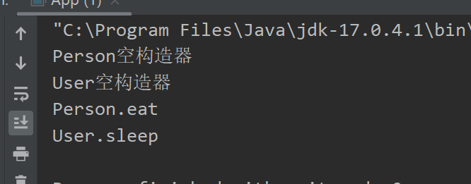
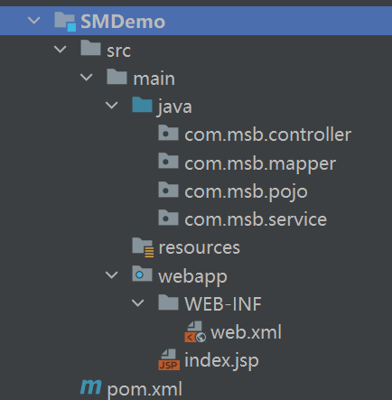

## 主要内容


## Spring 框架介绍

### Spring 框架的优势(对比以前项目的缺点)

（1）单纯使用Mybatis框架，业务层代码复杂，需要用大量的代码自行解析mybatis.xml配置文件，压力都给到了业务层代码，如下代码：

```java
public class Test2 {
    public static void main(String[] args) throws IOException {
        //指定核心配置文件的路径：
        String resource = "mybatis.xml";
        //获取加载配置文件的输入流：
        InputStream inputStream = Resources.getResourceAsStream(resource);
        //加载配置文件，创建工厂类
        SqlSessionFactory sqlSessionFactory = new SqlSessionFactoryBuilder().build(inputStream);
        //通过工厂类获取一个会话：
        SqlSession sqlSession = sqlSessionFactory.openSession();
        //代理
        BookMapper mapper = sqlSession.getMapper(BookMapper.class);
        //Book book = mapper.selectOneBook("项目驱动零起点学Java", "马士兵、赵珊珊");
        Book b = new Book();
        b.setName("项目驱动零起点学Java");
        b.setAuthor("马士兵、赵珊珊");
        //Book book = mapper.selectOneBook2(b);
        Book book = mapper.selectOneBook3("项目驱动零起点学Java", b);

        System.out.println(book.getName());
        //关闭资源：
        sqlSession.close();
    }
}
```

学习了spring以后，mybaits的使用会更加简单，会简化业务层处理的代码。

（2）层与层之间的耦合性太高了。比如在分层思想中，controller层调用service层，service层调用mapper层（dao层），controller层中调用service层的对象的时候，需要构建service层对象，此时如果service改变，那么controller层中所有new service层对象的位置全部需要改变。学了spring以后，你看不到new对象了，创建对象交由spring来完成，就是我们要学习的ioc/di部分。

（3）mybatis中处理事务的方式与传统JDBC是一样的，事务管理不够方便，现在可以交由Spring来管理。就是我们要学习的tx部分。

（4）目前的项目没有扩展性而言。比如我们写好的项目部署的话，需要把项目的war包发到服务器上，但是war包中都是class文件，没有办法修改，你想要对某个功能进行扩展是做不到的，学了spring以后，就可以在不改变原有代码的情况下，在它基础上做扩展，就是我们要学习的aop部分。

（5）spring可以整合各种优秀的框架。spring也叫框架的框架，如整合springmvc，mybatis，就是我们常用的SSM框架。很多年前：SSH框架。

综上所述：Spring是一个全功能栈框架，功能非常全。


### Spring 框架引入

​		Spring 框架（Spring Framework）前身是interface21，由Rod Johnson于2002年研发。

​		

​		Spring 是众多开源java项目中的一员，基于分层的javaEE应用一站式轻量级开源框架，主要核心是 IOC/DI与 AOP两大技术，实现项目在开发过程中的轻松解耦，提高项目的开发效率。(上节课优势中我们已经说明了)

​		Spring最初火的原因是——轮子理论。

### 历史发展

* 2002年大约有3万行代码，interface21出现
* 2003年Rod Johnson和朋友在interface21基础上研发了Spring
* 2004年3月，Spring 1.0发布
* 2006年10月，Spring 2.0发布
* 2007年11月，更名为 SpringSource，同时发布了 Spring 2.5。
* 2009年12月，Spring 3.0 发布。同时把Spring由一个jar包拆分成多个jar包，真正实现模块化。
* 2013年12 月，Spring 框架 4.0发布
* 2017年9月，Spring框架5.0发布。
* 2022年11月，Spring框架6.0发布。 （里程碑版本，未来十年的开端）

到文档制作时，Spring框架最新版为6.0.5。

spring官网：https://spring.io/


### 框架学习三要素

框架学习三要素：jar包、API、源码。

（1）jar包：使用的时候去Maven仓库中查找即可。

注意：2009年12月，Spring 3.0 发布。同时把Spring由一个jar包拆分成多个jar包，真正实现模块化。

随着Spring框架的不断发展，在Spring官方压缩包中包含的模块对应的jar也越来越多。学习Spring其实就是在分别学习Spring所有模块的功能。

如果希望下载官方压缩包，查看所有jar包，可以通过下面链接下载。在Maven项目中，不需要单独下载下面内容：

https://repo.spring.io/libs-release-local/org/springframework/spring/ （下载spring的官方压缩包）

（2）API：

在https://spring.io/中查看：


（3）源码：

开源的，可自行下载源码：

https://github.com/spring-projects/spring-framework/tags  （下载源码）

### Spring 模块介绍

​		Spring是一个全功能栈框架，学习Spring其实就是在分别学习Spring所有模块的功能。Spring模块（Spring的组成部分）如下划分：


​	Spring 总共大约有20个模块，由1300多个不同的文件构成。而这些组件被分别整合在核心容器（Core Container）、Aop（Aspect Oriented Programming）和设备支持（Instrmentation）、数据访问及集成（Data Access/Integeration）、Web、报文发送（Messaging）、测试模块集合中。

1. 核心容器：Spring-beans 和 Spring-core 模块是 Spring 框架的核心模块，包含控制反转（Inversion of Control, IoC）和依赖注入（Dependency Injection, DI）,核心容器提供 Spring 框架的基本功能。核心容器的主要组件是 BeanFactory，工厂模式的实现。BeanFactory 使用控制反转（IOC） 思想将应用程序的配置和依赖性规范与实际的应用程序代码分开。

   Spring Context -Spring 上下文：Spring 上下文是一个配置文件，向 Spring 框架提供上下文信息。Spring 上下文包括企业服务，例如 JNDI、EJB、电子邮件、国际化、校验和调度功能。

   Spring-Expression 模块是统一表达式语言（unified EL）的扩展模块，可以查询、管理运行中的对象，同时也方便的可以调用对象方法、操作数组、集合等。它的语法类似于传统EL，但提供了额外的功能，最出色的要数函数调用和简单字符串的模板函数。

2. Spring-AOP：Spring-aop是Spring的另一个核心模块, 在Spring中，他是以JVM的动态代理技术为基础，然后设计出了一系列的Aop横切实现，比如前置通知、返回通知、异常通知等。通过其配置管理特性，Spring AOP 模块直接将面向切面的编程功能集成到了 Spring 框架中。所以，可以很容易地使 Spring 框架管理的任何对象支持 AOP。

3. Spring Data Access(数据访问)：由Spring-jdbc、Spring-tx、Spring-orm、Spring-jms和Spring-oxm 5个模块组成 。

   Spring-jdbc 模块是 Spring 提供的JDBC抽象框架的主要实现模块，用于简化 Spring JDBC。

   Spring-tx 模块是SpringJDBC事务控制实现模块。使用Spring框架，它对事务做了很好的封装，通过它的Aop配置，可以灵活的配置在任何一层。

   Spring-Orm 模块是ORM框架支持模块，主要集成 hibernate, Java Persistence API (JPA) 和 Java Data Objects (JDO) 用于资源管理、数据访问对象(DAO)的实现和事务策略。

   Spring-Jms 模块（Java Messaging Service）能够发送和接受信息。

   Spring-Oxm 模块主要提供一个抽象层以支撑OXM（OXM 是 Object-to-XML-Mapping 的缩写，它是一个O/M-mapper，将java对象映射成 XML 数据，或者将 XML 数据映射成 java 对象），例如：JAXB, Castor, XMLBeans, JiBX 和 XStream 等。

4. Web 模块：由Spring-web、Spring-webmvc、Spring-websocket和Spring-webmvc-portlet 4个模块组成，Web 上下文模块建立在应用程序上下文模块之上，为基于 Web 的应用程序提供了上下文。Web 模块还简化了处理多部分请求以及将请求参数绑定到域对象的工作。（这部分就是学习SpringMVC，这里可以看出，Springmvc是包含于spring的框架。）

5. 报文发送：即Spring-messaging模块。

   Spring-messaging是Spring4 新加入的一个模块，主要职责是为Spring 框架集成一些基础的报文传送应用。

6. 单元测试：即Spring-test模块。Spring-test模块主要为单元测试提供支持 。


## Spring IoC/DI - 引入

### IoC/DI 概念辨析

【1】IoC/DI 

IoC(Inversion of Control)中文名称：控制反转，也被称为DI(dependency injection )：依赖注入，属于同一件事情的两个名称。（一定注意，是一个事，不是两个事）

IoC/DI是指一个过程：创建对象的权利，或者是控制的位置，由JAVA代码转移到spring容器，由spring的容器控制对象的创建，就是控制反转，spring创建对象时，会读取配置文件中的信息，然后使用反射给我们创建好对象之后在容器（其实就是一个map集合）中存储起来，当我们需要某个对象时，通过id获取对象即可，不需要我们自己去new。

**一句话：创建对象交给容器去做。**

由于控制反转概念比较含糊，所以在 2004 年大师级人物Martin Fowler又给出了一个新的名字:“依赖注入”，相对loC而言，“依赖注入”明确描述了“被注入对象依赖loC容器来配置依赖对象”，Dl(英文全称为Dependency Injection，中文译名为依赖注入）是loC的别名。可以简单理解为，容器创建某个依赖对象，并将该依赖对象注入到需要该依赖对象的地方（也可称之为被注入对象)。

【2】容器（Container）

spring容器，放置所有管理对象的对象。其本质是在容器对象里面有一个全局Map对象，map对象中放置所有被管理的对象。Spring中容器是指ApplicationContext接口及子接口或实现类。

【3】bean

容器中所有被管理的对象称为beans，如果单说其中一个对象可称为bean。

### 使用IoC/DI的好处

Spring IoC/DI使用后可以管理项目中相关对象，让对象管理的事情和业务分离（解耦）。同时程序员也不管理对象的依赖关系，所有的依赖关系交给Spring容器进行管理。

案例：

没有使用spring之前：


使用spring-IoC/DI以后：


以后如果改变实现类，只需要修改配置文件即可，不需要去java代码中操作了。

要注意我们改都是改实现类，不会改接口，接口是规范，就像灯坏了我们一般换灯泡，不会把灯拆了。

### IoC/DI具体应用场景

IoC/DI 主要作用就是管理对象的实例化和对象之间依赖关系。项目中以前需要自己实例化的层对象、需要自己实例化框架或工具包的入口类都可以交给Spring 容器进行管理。

* 层对象：PeopleMapper 接口代理对象、PeopleDaoImpl、PeopleServiceImpl
* 框架入口类：SqlSessionFactory等

下图中对应普通类PeopleMapper、PeopleServiceImpl这些不同层中普通都可以交给Spring容器进行管理。放入到容器中的对象可以相互直接依赖。但是Servlet只能被Tomcat管理（由Tomcat帮助实例化创建的），所以Spring容器是无法管理Servlet的。但是Servlet可以从Spring容器中取出对象。


## Spring IoC/DI - 代码实现

### 环境准备

（1）idea版本：IntelliJ IDEA 2022.3.1

（2）Maven版本：3.6+

确定Maven环境：


（3）Spring6要求JDK为17以上：

安装JDK17：


在idea中设置jdk:


（4）spring版本：6.0.5

### Spring 框架环境搭建

实现案例：创建Person类，让Spring帮我们管理对象。

#### 创建Maven聚合工程

使用聚合工程以后，以后的项目创建在聚合工程中，以模块的形式存在即可。

创建Maven聚合工程:


因为聚合工程中不需要写java代码，所以可以将src删除：


#### 新建 Maven 项目（模块）

聚合项目Spring6--》右键---》New---》Module：

Spring项目不需要依赖tomcat，所以构建普通java项目即可：


创建好以后变为如下：


#### 在pom.xml中添加spring的依赖

在Spring6Demo01模块下的pom.xml中添加spring的依赖。

Spring项目的最基本依赖包含：

* spring-context.jar。spring上下文依赖，它依赖了下面的四个jar。
* spring-core.jar。Spring 核心jar包。它依赖了spring-jcl.jar
* spring-aop.jar。Spring AOP面向切面编程的基本支持。
* spring-expression.jar。Spring的表达式语言支持。
* spring-beans.jar。Spring容器的bean管理，创建对象非常重要的包。
* spring-jcl.jar。内置的日志包，Spring 4版本时使用的还是common-logging.jar呢，但是从5开始Spring自己对日志进行了封装。

但是在Maven项目中想要使用Spring框架只需要在项目中导入spring-context就可以了，其他的jar包根据Maven依赖传递性都可以导入进来。

```xml
<project xmlns="http://maven.apache.org/POM/4.0.0" xmlns:xsi="http://www.w3.org/2001/XMLSchema-instance"
         xsi:schemaLocation="http://maven.apache.org/POM/4.0.0 http://maven.apache.org/xsd/maven-4.0.0.xsd">
    <modelVersion>4.0.0</modelVersion>
    <parent>
        <groupId>com.msb</groupId>
        <artifactId>Spring6</artifactId>
        <version>1.0-SNAPSHOT</version>
    </parent>

    <artifactId>Spring6Demo01</artifactId>
    <packaging>jar</packaging>

    <name>Spring6Demo01</name>
    <url>http://maven.apache.org</url>

    <properties>
        <project.build.sourceEncoding>UTF-8</project.build.sourceEncoding>
    </properties>

    <dependencies>
        <!--添加spring-context依赖-->
        <dependency>
            <groupId>org.springframework</groupId>
            <artifactId>spring-context</artifactId>
            <version>6.0.5</version>
        </dependency>

        <dependency>
            <groupId>junit</groupId>
            <artifactId>junit</artifactId>
            <version>3.8.1</version>
            <scope>test</scope>
        </dependency>
    </dependencies>
</project>

```

查看项目依赖为：


#### 随意创建一个类：创建Person类

```java
package com.msb.pojo;

/**
 * @Author: zhaoss
 */
public class Person {
    // 属性
    private int age;
    private String name;
    private double height;

    public int getAge() {
        return age;
    }
    // 提供setter\getter方法
    public void setAge(int age) {
        this.age = age;
    }

    public String getName() {
        return name;
    }

    public void setName(String name) {
        this.name = name;
    }

    public double getHeight() {
        return height;
    }

    public void setHeight(double height) {
        this.height = height;
    }

    public Person() {
        System.out.println("空参构造器");
}

    public Person(int age, String name, double height) {
        System.out.println("有参构造器");
        this.age = age;
        this.name = name;
        this.height = height;
    }

    @Override
    public String toString() {
        return "Person{" +
                "age=" + age +
                ", name='" + name + '\'' +
                ", height=" + height +
                '}';
    }
}

```


#### 添加Spring 配置文件

在 src\main\下新建resources 目录。

在 src\main\resources 目录下新建 applicationContext.xml 文件，并拷贝官网文档提供的模板内容到 xml 中。

> 文件名称没有强制要求。官方示例中配置文件名称叫做applicationContext.xml，所以我们也把Spring配置文件叫做applicationContext.xml

<font color="red">配置 bean 到 xml 中，把对应 bean 纳入到 Spring 容器来管理</font>

applicationContext.xml

```xml
<?xml version="1.0" encoding="UTF-8"?>
<beans xmlns="http://www.springframework.org/schema/beans"
    xmlns:xsi="http://www.w3.org/2001/XMLSchema-instance"
    xsi:schemaLocation="http://www.springframework.org/schema/beans
        https://www.springframework.org/schema/beans/spring-beans.xsd">
    <!--
            id：bean对象的id，唯一标识。一般是Bean对象的名称的首字母小写
            class：bean对象的类路径
    -->
    <bean id="p" class="com.zss.pojo.Person"></bean>

</beans>
```

PS :上面的文档头和约束，可以从官方文档中粘贴过来就行：https://docs.spring.io/spring-framework/docs/current/reference/html/core.html#beans-factory-metadata


项目结构：


#### 加载配置文件，获取实例化对象

```java
import com.zss.pojo.Person;
import org.springframework.context.ApplicationContext;
import org.springframework.context.support.ClassPathXmlApplicationContext;

public class App {
    public static void main(String[] args) {
        // Spring通过加载配置文件，创建Spring容器。
        ApplicationContext ac = new ClassPathXmlApplicationContext("applicationContext.xml");
        // 从容器中取出叫做p的bean
        // 第二个参数设置取出Bean的类型。如果没有第二个参数，返回值类型为Object
        Person p = ac.getBean("p", Person.class);//这种方式不需要强转
        Person p2 = (Person)ac.getBean("p");//这种方式需要强转
        System.out.println(p == p2);//这个结果为true，证明从容器中获取的对象是同一个对象
        System.out.println(p);
        System.out.println(p2);
    }
}

```

可以自己验证一下，将其余代码注释，只留下ApplicationContext ac = new ClassPathXmlApplicationContext("applicationContext.xml");这句话执行以后，无参构造器就会调用了，侧面验证出在解析xml文件以后会先将各个bean放入容器供给我们使用。

上述代码结果：


## Spring IoC/DI - 容器 Bean 对象实例化模拟

之前已经明白了IOC的原理：


在不依赖spring的情况下，自己模拟bean对象实例化的过程。

新建Spring6Demo02项目（Maven-jar项目）

思路:

（1）定义xml文件，里面定义bean标签，因为后续每个bean标签会被解析为一个对象

（2）解析xml文件(dom4j)，解析的时候，会解析xml文件中的bean标签，每个bean标签转换为一个bean对象，此对象包含两个属性：id、class，此对象用来存放bean的id和class值。

（3）因为xml文件中bean标签可能是多个，所以定义一个List集合，存储bean对象。

（4）遍历List集合，得到每一个bean对象，通过bean对象的class属性，反射创建对应的对象。

（5）对象创建好以后，将bean对象的id和反射创建的对象，放入map集合中。

（6）定义一个工厂，（2）-（5）步骤放在工厂的构造器中完成

（7）工厂中定义获取对象的方法，通过id从map集合中获取对象。

### 构建实体类Person类和User类

```java
package com.msb.pojo;

/**
 * @Author: zhaoss
 */
public class Person {
    private int age;
    private String name;

    public int getAge() {
        return age;
    }

    public void setAge(int age) {
        this.age = age;
    }

    public String getName() {
        return name;
    }

    public void setName(String name) {
        this.name = name;
    }

    public Person() {
        System.out.println("Person空构造器");
    }

    public Person(int age, String name) {
        System.out.println("Person有参构造器");
        this.age = age;
        this.name = name;
    }

    @Override
    public String toString() {
        return "Person{" +
                "age=" + age +
                ", name='" + name + '\'' +
                '}';
    }
    
    public void eat(){
        System.out.println("Person.eat");
    }
}

```

```java
package com.msb.pojo;

/**
 * @Author: zhaoss
 */
public class User {
    private String uname;
    private String pwd;

    public String getUname() {
        return uname;
    }

    public void setUname(String uname) {
        this.uname = uname;
    }

    public String getPwd() {
        return pwd;
    }

    public void setPwd(String pwd) {
        this.pwd = pwd;
    }

    public User() {
        System.out.println("User空构造器");
    }

    public User(String uname, String pwd) {
        System.out.println("User有参构造器");
        this.uname = uname;
        this.pwd = pwd;
    }

    @Override
    public String toString() {
        return "User{" +
                "uname='" + uname + '\'' +
                ", pwd='" + pwd + '\'' +
                '}';
    }
    
    public void sleep(){
        System.out.println("User.sleep");
    }
}

```


### 准备自定义配置文件

applicationContext.xml:

```xml
<?xml version="1.0" encoding="utf-8" ?>
<beans>
    <bean id="person" class="com.msb.pojo.Person"></bean>
    <bean id="user" class="com.msb.pojo.User"></bean>
</beans>
```

此时目录结构为：


### 定义 Bean 属性对象

```java
package com.msb.spring;


/**
 * @Author: zhaoss
 * bean对象
 *      用来接收配置文件中bean标签的id与class属性值
 */
public class MyBean {

    private String id; //bean标签的id的属性值
    private String clazz; //bean标签的class的属性值

    public MyBean() {
    }

    public MyBean(String id, String clazz) {
        this.id = id;
        this.clazz = clazz;
    }

    public String getId() {
        return id;
    }

    public void setId(String id) {
        this.id = id;
    }

    public String getClazz() {
        return clazz;
    }

    public void setClazz(String clazz) {
        this.clazz = clazz;
    }
}

```


### 添加 dom4j 坐标依赖

```xml
<!-- dom4j -->
<dependency>
    <groupId>dom4j</groupId>
    <artifactId>dom4j</artifactId>
    <version>1.6.1</version>
</dependency>
<!-- XPath :XPath即为XML路径语言（XML Path Language），它是一种用来确定XML文档中某部分位置的语言。
Jaxen是Java的通用XPath引擎。-->
<dependency>
    <groupId>jaxen</groupId>
    <artifactId>jaxen</artifactId>
    <version>1.1.6</version>
</dependency>
```


### 定义 Bean 工厂接口

```java
package com.msb.spring;

/**
 * Bean 工厂接口定义
 */
public interface MyFactory {
    // 通过id值获取对象
    public Object getBean(String id);
}
```


### 定义 Bean 接口的实现类

```java
package com.msb.spring;

import org.dom4j.Document;
import org.dom4j.DocumentException;
import org.dom4j.Element;
import org.dom4j.XPath;
import org.dom4j.io.SAXReader;
import java.net.URL;
import java.util.ArrayList;
import java.util.HashMap;
import java.util.List;
import java.util.Map;

/**
 * 模拟Spring的实现
 *  1、通过构造器得到相关配置文件
 *  2、通过dom4j解析xml文件，得到List   存放id和class
 *  3、通过反射实例化得到对象   Class.forName(类的全路径).newInstance(); 通过Map<id,Class>存储
 *  4、得到指定的实例化对象
 */
public class MyClassPathXmlApplicationContext implements BeanFactory {

    private Map beans = new HashMap(); // 实例化后的对象放入map
    private List<MyBean> myBeans; // 存放已读取bean 配置信息

    /* 1、通过构造器得到相关配置文件 */
    public MyClassPathXmlApplicationContext(String fileName) {

        /* 2、通过dom4j解析xml文件，得到List （存放id和class） */
        this.parseXml(fileName);

        /* 3、通过反射实例化得到对象Class.forName(类路径).newInstance();  通过Map存储 */
        this.instanceBean();

    }

    /**
     * 通过dom4j解析xml文件，得到List   存放id和class
     *  1、获取解析器
     *  2、得到配置文件的URL
     *  3、通过解析器解析xml文件（applicationContext.xml）
     *  4、通过xpath语法，获取beans标签下的所有bean标签
     *  5、通过指定语法解析文档对象，返回集合
     *  6、判断集合是否为空，遍历集合
     *  7、获取标签元素中的属性
     *  8、得到Bean对象，将Bean对象设置到集合中
     * @param fileName
     */
    private void parseXml(String fileName) {
        // 1、获取解析器
        SAXReader reader = new SAXReader();
        // 2、得到配置文件的URL
        URL url = this.getClass().getClassLoader().getResource(fileName);
        try {
            // 3、通过解析器解析xml文件（applicationContext.xml）
            Document document = reader.read(url);
            // 4、通过xpath语法，获取beans标签下的所有bean标签
            XPath xPath = document.createXPath("beans/bean");
            // 通过指定语法解析文档对象，返回集合
            List<Element> list = xPath.selectNodes(document);
            // 每个文档对象Element可以看一下长什么样：
            for(Element el : list) {
                System.out.println(el + "--------");
            }
            // 判断集合是否为空，遍历集合 ：把文档对象转为 MyBean对象
            if (list != null && list.size() > 0) {
                myBeans = new ArrayList<>();
                for(Element el : list) {
                    // 获取标签元素中的属性
                    String id = el.attributeValue("id"); // id 属性值
                    String clazz = el.attributeValue("class"); // class 属性值
                    System.out.println(el.attributeValue("id"));
                    System.out.println(el.attributeValue("class"));
                    // 得到Bean对象
                    MyBean bean = new MyBean(id, clazz);
                    // 将Bean对象设置到集合中
                    myBeans.add(bean);
                }
            }
        } catch (DocumentException e) {
            e.printStackTrace();
        }
    }

    /**
     * 通过反射实例化得到对象  
     * 	Class.forName(类的全路径).newInstance();  
     *	通过Map<id,Class>存储
     */
    private void instanceBean() {
        // 判断bean集合是否为空，不为空遍历得到对应Bean对象
        if (myBeans != null && myBeans.size() > 0) {
            for (MyBean bean : myBeans){                                      
                try {
                    // 通过类的全路径实例化对象
                    Object object = Class.forName(bean.getClazz()).newInstance();
                    // 将id与实例化对象设置到map对象中
                    beans.put(bean.getId(), object);
                } catch (Exception e) {
                    e.printStackTrace();
                }
            }
        }
    }

    /**
     * 通过key获取map中的指定value
     * @param id
     * @return
     */
    @Override
    public Object getBean(String id) {
        Object object = beans.get(id);
        return object;
    }
}
```

此时目录结构为：


### 测试自定义 IOC 容器

测试是否可以获取实例化的Bean对象

```java
package com.msb;

import com.msb.pojo.Person;
import com.msb.pojo.User;
import com.msb.springdiy.MyClassPathXmlApplicationContext;
import com.msb.springdiy.MyFactory;

/**
 * Hello world!
 *
 */
public class App 
{
    public static void main( String[] args )
    {
       // 构建工厂对象：
        MyFactory factory = new MyClassPathXmlApplicationContext("applicationContext.xml");
        // 获取对象：
        Person person = (Person)factory.getBean("person");
        User user = (User)factory.getBean("user");
        // 调用对象的方法：
        person.eat();
        user.sleep();

    }
}

```

测试结果：

​	

大致完成了模拟：在启动的时候 读取xml配置信息，并对配置的 bean 进行实例化（这里模拟的比较简单，仅用于帮助大家理解），同时通过上下文对象提供的 getBean() 方法拿到我们配置的 bean 对象，从而实现外部容器自动化维护并创建 bean 的效果。


##  Spring IoC/DI - Bean 对象实例化方式

在Spring中实例化Bean有三种方式：

* 通过构造方法进行实例化。默认使用无参构造。这种方式和以前new的方式是等效的。上面的入门Spring项目其实就是这种，只需要在XML中通过`<bean>`的class属性指定类的全限定路径，然后就可以实例化对象。
* 通过工厂进行实例化。其中包含两种，可以通过静态工厂和实例工厂进行实例化。这种方式完全是根据设计模式中工厂模式的思想而研发出的。Spring考虑到如果需要频繁实例化某个类的对象，工厂模式无疑是一个好选择。


### 方式1：通过构造方法进行实例化

注：**通过默认构造器创建 空构造方法必须存在 否则创建失败**

创建项目、导入依赖过程省略，关键代码：

1. 设置配置文件 applicationContext.xml

   ```xml
   <?xml version="1.0" encoding="UTF-8"?>
   <beans xmlns="http://www.springframework.org/schema/beans"
          xmlns:xsi="http://www.w3.org/2001/XMLSchema-instance"
          xsi:schemaLocation="http://www.springframework.org/schema/beans
           https://www.springframework.org/schema/beans/spring-beans.xsd">
   
       <bean id="person" class="com.msb.pojo.Person"></bean>
   
   </beans>
   ```

2. 创建测试类，获取实例化对象

   ```java
   package com.msb;
   
   import com.msb.pojo.Person;
   import org.springframework.context.ApplicationContext;
   import org.springframework.context.support.ClassPathXmlApplicationContext;
   
   /**
    * Hello world!
    *
    */
   public class App 
   {
       public static void main( String[] args )
       {
           //  解析xml:
           ApplicationContext ac = new ClassPathXmlApplicationContext("applicationContext.xml");
           // 获取对象：
           Person person = ac.getBean("person", Person.class);
           person.eat();
       }
   }
   
   ```


### 工厂模式介绍

通常我们构建对象的时候都是随处new对象使用，使用工厂模式它提供了一种创建对象的最佳方式，工厂模式（Factory Pattern）是 Java 中最常用的设计模式之一。创建对象这事，交由工厂去做，你需要某个对象，从工厂中取即可。

在工厂模式中，创建对象不会对客户端暴露创建逻辑，并且是通过使用一个共同的接口来指向新创建的对象。

**使用工厂模式的好处**

（1）解耦
通过工厂模式可以把对象的创建和使用过程分割开来。比如说 Class A 想调用 Class B的方法，那么我们无需关心B是如何创建的，直接去工厂获取就行。

（2）减少代码量，易于维护
如果我们直接new一个对象时，如果需要的对象构造方法比较复杂，那么可能需要一连串的代码去创建对象，如果在别的类中又需要创建该对象，那么代码的重复度肯定不小。通过工厂模式的话，我们把对象创建的具体逻辑给隐藏起来了，交给工厂统一管理，这样不仅减少了代码量，以后如果想改代码的话，只需要改一处即可，也方便我们日常的维护。

**工厂模式使用的场景**

对象实例创建的过程比较复杂，并且需要准备很多参数的时候。
类具有很多子类，并且这些类的创建过程在业务中容易发生改变，如果没有工厂，需要在创建对象处一一修改，有了工厂以后只要在工厂中修改即可。


**案例：宠物店买宠物**

接口：

```java
package com.msb.factory;

/**
 * @Author: zhaoss
 */
public interface Animal {
}

```

实现类：

```java
package com.msb.factory;

/**
 * @Author: zhaoss
 */
public class Dog implements Animal {

}
```

```java
package com.msb.factory;

/**
 * @Author: zhaoss
 */
public class Cat implements Animal{
}
```

工厂：

```java
package com.msb.factory;

/**
 * @Author: zhaoss
 * 宠物店，需要动物的话就去宠物店购买：
 */
public class PetStore {//工厂类
    public Animal getAnimal(String petName){
        if ("猫".equals(petName)){
            return new Cat();
        }else if ("狗".equals(petName)){
            return new Dog();
        }else{
            return null;
        }
    }

    public static Animal getAnimal2(String petName){
        if ("猫".equals(petName)){
            return new Cat();
        }else if ("狗".equals(petName)){
            return new Dog();
        }else{
            return null;
        }
    }
}
```

测试：

```java
package com.msb.factory;

/**
 * @Author: zhaoss
 */
public class Test {
    public static void main(String[] args) {
        // 从工厂中获取动物：
        PetStore ps = new PetStore();
        // 调用工厂中普通方法：
        Animal an = ps.getAnimal("猫");
        Animal an2 = ps.getAnimal("狗");

        // 调用工厂中静态方法：不需要构建工厂对象
        Animal an3 = PetStore.getAnimal2("猫");
    }
}
```


### 工厂实例化介绍

Spring也提供了对工厂实例化的简化，但是你一定要明确简化的是什么。它并不是把工厂代替了，工厂还是原来的工厂，对工厂没有影响的，只是把调用工厂的过程简化了。

当我们指定Spring使用工厂方法来创建Bean实例时，Spring将先解析配置文件，并根据配置文件指定的信息，通过反射调用工厂类的工厂方法，并将该工厂方法的返回值作为Bean实例，在这个过程中，**Spring不再负责创建Bean实例，Bean实例是由用户提供的工厂方法提供的。**

### 方式2：实例化工厂实例化

实例化工厂实例化：

- 工厂方法为非静态方法
- 需要配置工厂bean，并在业务bean中配置factory-bean，factory-method属性

1. 工厂类

使用工厂模式中的工厂即可 

2. 设置配置文件applicationContext.xml

```xml
<?xml version="1.0" encoding="UTF-8"?>
<beans xmlns="http://www.springframework.org/schema/beans"
       xmlns:xsi="http://www.w3.org/2001/XMLSchema-instance"
       xsi:schemaLocation="http://www.springframework.org/schema/beans
        https://www.springframework.org/schema/beans/spring-beans.xsd">

    <!--
		实例化工厂
			1.定义实例化工厂bean
    		 2.业务bean中引用工厂bean，指定工厂创建方法(方法为非静态)
	-->
    <!--帮助我们完成PetStore的实例化：替代PetStore ps = new PetStore()-->
    <bean id="factory" class="com.msb.factory.PetStore"></bean>
    <!--替代： Animal an = ps.getAnimal("猫"); -->
    <bean id="a" factory-bean="factory" factory-method="getAnimal">
    	<constructor-arg name="petName" value="猫"></constructor-arg>
    </bean>

</beans>
```

3. 获取实例化对象

```java
ApplicationContext ac = new ClassPathXmlApplicationContext("applicationContext.xml");
Animal an = (Animal) ac.getBean("a");  
```


PS：可能你觉得这个配置比我们自己去使用工厂麻烦，那是因为当前工厂是你自己写的，实际用的工厂都是别人提供的，spring提供了调用工厂的这种配置。

### 方式3：静态工厂实例化

静态工厂实例化

- 要有该工厂类及工厂方法  
- 工厂方法为静态的


1. 工厂类

   使用工厂模式中的工厂即可 

2. 设置配置文件 spring.xml

   ```xml
   <?xml version="1.0" encoding="UTF-8"?>
   <beans xmlns="http://www.springframework.org/schema/beans"
          xmlns:xsi="http://www.w3.org/2001/XMLSchema-instance"
          xsi:schemaLocation="http://www.springframework.org/schema/beans
           https://www.springframework.org/schema/beans/spring-beans.xsd">
   
       <!--静态工厂替代：Animal an3 = PetStore.getAnimal2("猫");-->
       <bean id="a2" class="com.msb.factory.PetStore" factory-method="getAnimal2">
       	<constructor-arg name="petName" value="猫"></constructor-arg>
       </bean>
   
   </beans>
   ```

3. 获取实例化对象

   ```java
   ApplicationContext ac = new ClassPathXmlApplicationContext("applicationContext.xml");
   Animal an = (Animal) ac.getBean("a2");  
   ```
   


**项目开发基本采用第一种方式实例化bean，交给Spring托管，使用时直接拿来使用即可。另外两种了解**

## Spring IoC/DI -  属性注入

Bean对象实例化讲解的是如何实例化Bean，下面讲解的是如果给Bean对象的属性进行赋值。

Spring中给Bean对象属性赋值也称为注入，有两种方式：

* 构造注入（Constructor-based Dependency Injection）：通过构造方法给bean的属性赋值。所以要求bean的类中必须提供对应参数的构造方法。相当于以前创建对象时new Person(18,"丽丽");
* 设值注入，又称setter注入（Setter-based Dependency Injection）：通过Bean的setter方法赋值。所以要求Bean中属性必须提供setter方法。相当于以前的：Person p  = new Person(); p.setAge(18); p.setName("丽丽");


### 构造注入

构造注入要求必须在Bean中提供有参构造方法（无参数最好也提供上，这个位置不用。但是其他位置如果没有通过构造注入，默认是调用无参构造）。


#### 定义Bean类和有参构造方法

班级类：

```java
package com.msb.pojo;

/**
 * @Author: zhaoss
 * 班级类
 */
public class Clazz {
    // 属性：
    private int cid;
    private String cname;
    /* 在本次案例中，省去setter、getter方法，因为我们练习的是构造注入，需要有参构造器
    * 但是为了防止代码出错，一般会加入setter、getter方法*/

    public Clazz(int cid, String cname) {
        System.out.println("Clazz的有参构造器1");
        this.cid = cid;
        this.cname = cname;
    }

    /*当前构造注入的时候，不需要使用空构造器，但是为了防止代码出错，一般我们会加入空构造器*/
    public Clazz() {
    }

    @Override
    public String toString() {
        return "Clazz{" +
                "cid=" + cid +
                ", cname='" + cname + '\'' +
                '}';
    }
}

```

学生类：

```java
package com.msb.pojo;

/**
 * @Author: zhaoss
 */
public class Student {
    private int age;
    private String name;
    private Clazz clazz;
    
	/* 在本次案例中，省去setter、getter方法，因为我们练习的是构造注入，需要有参构造器
    * 但是为了防止代码出错，一般会加入setter、getter方法*/
    
    
    public Student(int age, String name, Clazz clazz) {
        this.age = age;
        this.name = name;
        this.clazz = clazz;
    }


    @Override
    public String toString() {
        return "Student{" +
                "age=" + age +
                ", name='" + name + '\'' +
                ", clazz=" + clazz +
                '}';
    }
}

```


####  配置bean

在配置文件applicationContext.xml中可以通过`<bean>`的子标签`<constructor-arg>`设置构造方法中一个参数的值。

> 解释说明：
>
> constructor-arg 里面有5个属性，这5个属性分为2类。
>
> （1）用来确定给哪个属性进行赋值
>
> ​	name：参数名称
>
> ​	index：参数索引。从0开始算起。
>
> ​	type：参数类型。8大基本数据类型可以直接写关键字。其他类型需要写类型的全限定路径。
>
> 这三个属性如果只需要用到一个就能精确的告诉Spring，要设置的构造方法参数是哪个，就可以使用一个。如果无法精确到某个构造方法参数，可以多个一起结合使用。
>
> （2）设置属性的值
>
> ​	value：简单数据类型（String、基本数据类型）直接设置。Spring会自动进行类型转换。
>
> ​	ref：需要引用另一个bean的id。也就是说这个参数是一个类类型，且这个类的对象也被Spring容器管理。


```xml
<?xml version="1.0" encoding="UTF-8"?>
<beans xmlns="http://www.springframework.org/schema/beans"
       xmlns:xsi="http://www.w3.org/2001/XMLSchema-instance"
       xsi:schemaLocation="http://www.springframework.org/schema/beans
        https://www.springframework.org/schema/beans/spring-beans.xsd">

    <!--利用这种方式，底层会去寻找空构造器-->
    <bean id="c1" class="com.msb.pojo.Clazz"></bean>
    <!--利用构造注入的方式，对属性进行初始化操作-->
    <!--通过name属性，通过参数的名字进行赋值-->
    <bean id="c2" class="com.msb.pojo.Clazz">
        <constructor-arg name="cid" value="1"></constructor-arg>
        <constructor-arg name="cname" value="java506班"></constructor-arg>
    </bean>
    <!--通过index属性，通过参数的索引进行赋值-->
    <bean id="c3" class="com.msb.pojo.Clazz">
        <constructor-arg index="0" value="2"></constructor-arg>
        <constructor-arg index="1" value="java302班"></constructor-arg>
    </bean>
    <!--通过type属性，通过参数的类型进行赋值-->
    <bean id="c4" class="com.msb.pojo.Clazz">
        <constructor-arg type="int" value="3"></constructor-arg>
        <constructor-arg type="java.lang.String" value="java816班"></constructor-arg>
    </bean>
    <!--name属性用的最多，index、type用的少-->
    <!--name\type\index属性可以单独使用，也可以配合使用-->
    <bean id="c5" class="com.msb.pojo.Clazz">
        <constructor-arg type="int" index="0" name="cid" value="4"></constructor-arg>
        <constructor-arg type="java.lang.String" index="1" name="cname" value="java999班"></constructor-arg>
    </bean>

    <!--构建Student对象
	ref：需要引用另一个bean的id。也就是说这个参数是一个类类型，且这个类的对象也被Spring容器管理。
	-->
    
    <bean id="stu" class="com.msb.pojo.Student">
        <constructor-arg name="age" value="18"></constructor-arg>
        <constructor-arg name="name" value="露露"></constructor-arg>
        <constructor-arg name="clazz" ref="c5"></constructor-arg>
    </bean>
</beans>
```


#### 编写测试类并观察控制台运行结果

```java
package com.msb;

import com.msb.pojo.Clazz;
import com.msb.pojo.Student;
import org.springframework.context.ApplicationContext;
import org.springframework.context.support.ClassPathXmlApplicationContext;

/**
 * Hello world!
 *
 */
public class App 
{
    public static void main( String[] args )
    {
        // 解析xml
        ApplicationContext ac = new ClassPathXmlApplicationContext("applicationContext.xml");
        // 获取对象：
        Clazz c1 = ac.getBean("c1", Clazz.class);
        System.out.println(c1);
        Clazz c2 = ac.getBean("c2", Clazz.class);
        System.out.println(c2);
        Clazz c3 = ac.getBean("c3", Clazz.class);
        System.out.println(c3);
        Clazz c4 = ac.getBean("c4", Clazz.class);
        System.out.println(c4);

        Student stu = ac.getBean("stu", Student.class);
        System.out.println(stu);
    }
}

```


结果：


### 设值注入（setter注入）


#### 定义Bean类和Setter方法

班级类：

```java
package com.msb.pojo;

/**
 * @Author: zhaoss
 */
public class Clazz {
    private int cid;
    private String cname;
    /*当前案例，是设置注入，与构造器无关，所以不加入构造*/
    /*当前案例，是设置注入，所以我们只增加setter方法*/

    public void setCid(int cid) {
        this.cid = cid;
    }

    public void setCname(String cname) {
        this.cname = cname;
    }

    @Override
    public String toString() {
        return "Clazz{" +
                "cid=" + cid +
                ", cname='" + cname + '\'' +
                '}';
    }
}

```

学生类：

```java
package com.msb.pojo;

/**
 * @Author: zhaoss
 */
public class Student {
    private int age;
    private String name;
    private Clazz clazz;

    public void setAge(int age) {
        this.age = age;
    }

    public void setName(String name) {
        this.name = name;
    }

    public void setClazz(Clazz clazz) {
        this.clazz = clazz;
    }

    @Override
    public String toString() {
        return "Student{" +
                "age=" + age +
                ", name='" + name + '\'' +
                ", clazz=" + clazz +
                '}';
    }
}

```


#### 配置Bean

在配置文件applicationContext.xml中可以通过`<bean>`的子标签`<property>`标签调用类的setter方法。

* name：属性名称。**name值如果是a，那么就会去找setA方法，一定要注意，name的值不是和属性对应，是和set方法名字对应。**
* value：属性值。
* ref：引用另一个bean标签的id属性。

```xml
<?xml version="1.0" encoding="UTF-8"?>
<beans xmlns="http://www.springframework.org/schema/beans"
       xmlns:xsi="http://www.w3.org/2001/XMLSchema-instance"
       xsi:schemaLocation="http://www.springframework.org/schema/beans
        https://www.springframework.org/schema/beans/spring-beans.xsd">
    <!--创建班级对象-->
    <bean id="c" class="com.msb.pojo.Clazz">
        <property name="cid" value="1"></property>
        <property name="cname" value="java302班"></property>
    </bean>
    <!--创建学生对象-->
    <bean id="stu" class="com.msb.pojo.Student">
        <!--name属性的值与set方法的名字有关，与类的属性名字无关-->
        <property name="age" value="18"></property>
        <property name="name" value="露露"></property>
        <property name="clazz" ref="c"></property>
    </bean>
</beans>
```


####  编写测试类并观察控制台结果

在测试类中获取bean对象，并输出到控制台，查看是否包含设置的值。

```java
package com.msb;

import com.msb.pojo.Student;
import org.springframework.context.ApplicationContext;
import org.springframework.context.support.ClassPathXmlApplicationContext;

/**
 * Hello world!
 *
 */
public class App 
{
    public static void main( String[] args )
    {
        // 解析xml：
        ApplicationContext ac = new ClassPathXmlApplicationContext("applicationContext.xml");
        // 获取对象：
        Student s = ac.getBean("stu", Student.class);
        System.out.println(s);
    }
}

```


结果：


**注意：以后用设值注入方式多，更灵活。构造注入方式不够灵活，构造器的参数需要制定，你调用构造器的时候需要去匹配。**


#### 注入方式的选择

​		**开发项目中set方式注入首选**

​		使用构造注入可以在构建对象的同时一并完成依赖关系的建立，对象一建立则所有的一切也就准备好了，但如果要建立的对象关系很多，使用构造器注入会在构建函数上留下一长串的参数,且不易记忆,这时使用Set注入会是个不错的选择。
　	使用Set注入可以有明确的名称，可以了解注入的对象会是什么，像setXXX()这样的名称，会比记忆Constructor上某个参数的位置代表某个对象更好。


#### p名称空间的使用

​	spring2.5以后，为了简化setter方法属性注入，引用p名称空间的概念，可以将<property> 子元素，简化为<bean>元素属性配置。

​	在配置文件 spring.xml 引入 p 名称空间

```xml
xmlns:p="http://www.springframework.org/schema/p"
```

```xml
<?xml version="1.0" encoding="UTF-8"?>
<beans xmlns="http://www.springframework.org/schema/beans"
       xmlns:xsi="http://www.w3.org/2001/XMLSchema-instance"
       xmlns:p="http://www.springframework.org/schema/p"
       xsi:schemaLocation="http://www.springframework.org/schema/beans
        https://www.springframework.org/schema/beans/spring-beans.xsd">
    <!--
		p:属性名:="xxx"		引入简单类型属性值
		p:属性名-ref:="xxx"	引入其他Bean对象的id属性值
	-->
    
    <!--创建班级对象-->
    <bean id="c" class="com.msb.pojo.Clazz" p:cid="1" p:cname="java302班" >
    </bean>
    <!--创建学生对象-->
    
    <bean id="stu" class="com.msb.pojo.Student" p:age="18" p:name="露露"  p:clazz-ref="c" / >
  
</beans>
```


### 不同属性类型注入对应的写法

无论是构造注入还是设值注入都提供了value和ref进行设置值，这两个属性只能给属性赋予简单数据类型或其他bean的引用。如果类的属性是数组、集合等类型需要通过下面方式进行设置。

这些标签都是`<property>`或`<constructor-args>`的子标签。

一旦使用了下面子标签方式，就不能对`<property>`或`<constructor-args>`设置value属性或ref属性。且需要在People类中提供对应名称，对应类型的属性。

案例：People类提供对应类型，对应名称属性的代码。

#### 定义People类和setter方法

```java
package com.msb.pojo;

import java.util.Arrays;
import java.util.List;
import java.util.Map;
import java.util.Set;

/**
 * @Author: zhaoss
 */
public class Person {
    // 属性：
    private String[] arr;
    private List<String> list;
    private Set<String> set;
    private Map<Integer,String> map;

    public void setArr(String[] arr) {
        this.arr = arr;
    }

    public void setList(List<String> list) {
        this.list = list;
    }

    public void setSet(Set<String> set) {
        this.set = set;
    }

    public void setMap(Map<Integer, String> map) {
        this.map = map;
    }

    @Override
    public String toString() {
        return "Person{" +
                "arr=" + Arrays.toString(arr) +
                ", list=" + list +
                ", set=" + set +
                ", map=" + map +
                '}';
    }
}

```


#### 配置bean

 Array类型\List类型\Set类型\Map类型\ Null值类型

```java
<?xml version="1.0" encoding="UTF-8"?>
<beans xmlns="http://www.springframework.org/schema/beans"
       xmlns:xsi="http://www.w3.org/2001/XMLSchema-instance"
       xsi:schemaLocation="http://www.springframework.org/schema/beans
        https://www.springframework.org/schema/beans/spring-beans.xsd">
    <!--构建Person对象，对不同类型的属性进行赋值，进行属性注入，利用设置注入的方式-->
    <bean id="p" class="com.msb.pojo.Person">
        <!--可以利用设置注入，也可以利用构造注入，只是我当前的案例是利用设置注入-->
        <!--对数组类型进行注入-->
        <property name="arr" >
            <array>
                <value>aaa</value>
                <value>bbb</value>
                <value>ccc</value>
            </array>
        </property>

        <!--对List集合赋值：-->
        <property name="list">
            <list>
                <value>aaa</value>
                <value>bbb</value>
                <value>ccc</value>
            </list>
        </property>
        <!--对Set集合赋值：-->
        <property name="set">
            <set>
                <value>aaa</value>
                <value>bbb</value>
                <value>ccc</value>
            </set>
        </property>
        <!--对Map集合赋值：-->
        <!--<property name="map">
            <map>
                <entry>
                    &lt;!&ndash;key标签中不可以直接加入属性值，而是必须再套用value标签&ndash;&gt;
                    <key><value>18</value></key>
                    <value>露露</value>
                </entry>
                <entry>
                    &lt;!&ndash;key标签中不可以直接加入属性值，而是必须再套用value标签&ndash;&gt;
                    <key><value>21</value></key>
                    <value>菲菲</value>
                </entry>
                &lt;!&ndash;也可以利用entry的属性赋值&ndash;&gt;
                <entry key="22" value="小明" ></entry>
            </map>
        </property>-->

        <!--对Map集合赋空值-->
        <property name="map">
            <null></null>
        </property>
    </bean>

</beans>
```

#### 测试

```java
public class App2 {
    public static void main(String[] args) {
        ApplicationContext ac = new ClassPathXmlApplicationContext("applicationContext02.xml");
        Person p = ac.getBean("p", Person.class);
        System.out.println(p);
    }
}
```

运行结果：


### 循环依赖

有时会遇到如下场景：


**代码：**

**A类：**

```java
package com.msb.pojo;

/**
 * @Author: zhaoss
 */
public class A {
    // 属性：
    private B b;
    // 构造器：

    public A(B b) {
        this.b = b;
    }
   
}

```

**B类：**

```java
package com.msb.pojo;

/**
 * @Author: zhaoss
 */
public class B {
    // 属性:
    private A a;
    // 构造器：

    public B(A a) {
        this.a = a;
    }

    
}
```

**配置bean:**

```xml
<?xml version="1.0" encoding="UTF-8"?>
<beans xmlns="http://www.springframework.org/schema/beans"
       xmlns:xsi="http://www.w3.org/2001/XMLSchema-instance"
       xsi:schemaLocation="http://www.springframework.org/schema/beans
        https://www.springframework.org/schema/beans/spring-beans.xsd">
    <!--创建A对象-->
    <bean id="a" class="com.msb.pojo.A" scope="singleton">
        <constructor-arg name="b" ref="b"></constructor-arg>
    </bean>
    <!--创建B对象-->
    <bean id="b" class="com.msb.pojo.B">
        <constructor-arg name="a" ref="a"></constructor-arg>
    </bean>
</beans>
```

**测试：**

```java
public class App3 {
    public static void main(String[] args) {
        ApplicationContext ac = new ClassPathXmlApplicationContext("applicationContext03.xml");
    }
}
```

**运行结果报错：**


**出错原因：**

循环依赖问题，当两个类都是用构造注入时，没有等当前类实例化完成就需要注入另一个类，而另一个类没有实例化完整还需要注入当前类，所以这种情况是无法解决循环注入问题的的。会出现BeanCurrentlyInCreationException异常。


**解决方式：**

使用setter方式注入,并且bean标签默认有个属性省略不写了：scope="singleton" ,singleton:默认值,意味着bean是单例的，每次获取Bean都是同一个对象。因为单例默认下有三级缓存(DefaultSingletonBeanRegistry)，可以暂时缓存没有被实例化完成的Bean。三级缓存只有在setter方式下才有，因为构造注入的话没有需要缓存的对象，所以不需要使用三级缓存。

三级缓存：暂存没有创建好的对象，比如在当前案例中，A中想要注入b，b没创建好呢，将b放入缓存中，等b创建好了再从缓存中把b拿出来注入A即可。


**代码：**

**A类：**

```java
package com.msb.pojo;

/**
 * @Author: zhaoss
 */
public class A {
    // 属性：
    private B b;
    // 构造器：

    public A(B b) {
        this.b = b;
    }

    // 加入setter方法：

    public void setB(B b) {
        this.b = b;
    }

    // 加入空构造器：

    public A() {
    }
}
```

**B类：**

```java
package com.msb.pojo;

/**
 * @Author: zhaoss
 */
public class B {
    // 属性:
    private A a;
    // 构造器：

    public B(A a) {
        this.a = a;
    }

    // 加入setter方法：

    public void setA(A a) {
        this.a = a;
    }

    // 加入空构造器：

    public B() {
    }
}
```

**配置bean:**

```xml
<?xml version="1.0" encoding="UTF-8"?>
<beans xmlns="http://www.springframework.org/schema/beans"
       xmlns:xsi="http://www.w3.org/2001/XMLSchema-instance"
       xsi:schemaLocation="http://www.springframework.org/schema/beans
        https://www.springframework.org/schema/beans/spring-beans.xsd">
    <!--创建A对象-->
    <bean id="a" class="com.msb.pojo.A" scope="singleton">
        <!--<constructor-arg name="b" ref="b"></constructor-arg>-->
        <property name="b" ref="b"></property>
    </bean>
    <!--创建B对象-->
    <bean id="b" class="com.msb.pojo.B">
        <!--<constructor-arg name="a" ref="a"></constructor-arg>-->
        <property name="a" ref="a"></property>
    </bean>
</beans>
```

**测试：**

```java
public class App3 {
    public static void main(String[] args) {
        ApplicationContext ac = new ClassPathXmlApplicationContext("applicationContext03.xml");
        A a = ac.getBean("a", A.class);
        B b = ac.getBean("b", B.class);

    }
}
```


### 自动注入

在Spring中，允许Bean的自动注入。有两种方式进行配置：default-autowire和autowire,底层也是基于构造注入或者设置注入的。

* 在根标签`<bean>`中配置autowire属性，此标签代表整个Spring中自动注入的策略。autowire属性取值有5个。

  default:默认值。不自动注入。

  no：不自动注入。

  byName:通过名称自动注入。会自动寻找容器中id的名字 与当前属性同名的bean进行注入。（底层调用的是setter方法）

  byType：通过类型自动注入。会自动寻找容器中bean的类型  与当前bean类型匹配的bean进行注入。如果有多个相同类型的bean注入会出现异常。（底层调用的是setter方法）

  constructor:通过构造方法进行注入。寻找bean的构造方法中是否有合适的构造器。如果有自动注入进去。类型先byType后byName，如果没找到不注入。注：构造方法类型和其他Bean的类型相同。（底层调用的是构造器）


**byName案例：**

```xml
<?xml version="1.0" encoding="UTF-8"?>
<beans xmlns="http://www.springframework.org/schema/beans"
       xmlns:xsi="http://www.w3.org/2001/XMLSchema-instance"
       xsi:schemaLocation="http://www.springframework.org/schema/beans
        https://www.springframework.org/schema/beans/spring-beans.xsd"
       
    <bean id="s" class="com.msbt.pojo.Student" autowire="byName" ></bean>
</beans>
```

```java
package com.msb.pojo;

/**
 * @Author: zhaoss
 */
public class Clazz {
    private String cname;

    public String getCname() {
        return cname;
    }

    public void setCname(String cname) {
        this.cname = cname;
    }

    public Clazz(String cname) {
        this.cname = cname;
    }

    public Clazz() {
    }

    @Override
    public String toString() {
        return "Clazz{" +
                "cname='" + cname + '\'' +
                '}';
    }
}

```

```java
package com.msb.pojo;

/**
 * @Author: zhaoss
 */
public class Student {
    private Clazz clazz;

    public Clazz getClazz() {
        return clazz;
    }

    public void setClazz(Clazz clazz) {
        this.clazz = clazz;
    }

    public Student() {
    }

    public Student(Clazz clazz) {
        this.clazz = clazz;
    }

    @Override
    public String toString() {
        return "Student{" +
                "clazz=" + clazz +
                '}';
    }
}
```


测试：

```java
public class App 
{
    public static void main( String[] args )
    {
        ApplicationContext ac = new ClassPathXmlApplicationContext("applicationContext.xml");
        Student s = ac.getBean("s", Student.class);
        System.out.println(s);
    }
}
```


**byType案例：**

```xml
<?xml version="1.0" encoding="UTF-8"?>
<beans xmlns="http://www.springframework.org/schema/beans"
       xmlns:xsi="http://www.w3.org/2001/XMLSchema-instance"
       xsi:schemaLocation="http://www.springframework.org/schema/beans
        https://www.springframework.org/schema/beans/spring-beans.xsd">
    <bean id="s" class="com.msbt.pojo.Student" autowire="byType" ></bean>
</beans>
```


**constructor案例：**

```xml
<?xml version="1.0" encoding="UTF-8"?>
<beans xmlns="http://www.springframework.org/schema/beans"
       xmlns:xsi="http://www.w3.org/2001/XMLSchema-instance"
       xsi:schemaLocation="http://www.springframework.org/schema/beans
        https://www.springframework.org/schema/beans/spring-beans.xsd">
    <bean id="s" class="com.msbt.pojo.Student" autowire="constructor" ></bean>
</beans>
```


* 在`<beans>`标签中配置default-autowire属性。和autowire取值相同。唯一注意default表示全局default-autowire的值。如果autowire和default-autowire同时存在，autowire生效。

```xml
<bean id="s" class="com.msbt.pojo.Student" autowire="byType"></bean>
<?xml version="1.0" encoding="UTF-8"?>
<beans xmlns="http://www.springframework.org/schema/beans"
       xmlns:xsi="http://www.w3.org/2001/XMLSchema-instance"
       xsi:schemaLocation="http://www.springframework.org/schema/beans
        https://www.springframework.org/schema/beans/spring-beans.xsd"
       default-autowire="byType">
    <bean id="s" class="com.msbt.pojo.Student" ></bean>
</beans>
```


## Spring IoC/DI -  bean标签的scope属性

Spring中`<bean>`的scope控制的是Bean的有效范围。

一共有6个可取值,官方截图如下：


里面的singleton和prototype在Spring最基本的环境中就可以使用，不需要web环境。

但是里面的request、session、application、websocket都只有在web环境才能使用。

此处我们的案例都是普通java项目，所以我们重点讲解singleton和prototype，request、session、application、websocket配置方式和singleton和prototype相同，只是必须要有web环境支持，并配置相应的容器监听器或拦截器从而能应用这些作用域，目前先熟悉概念，后续集成web时讲解具体使用，大家只需要知道有这些作用域就可以了。


**案例：**

```java
package com.msb.pojo;

/**
 * @Author: zhaoss
 */
public class Person {
    private String name;

    public Person() {
        System.out.println("这是一个Person的空构造器");
    }
}
```

```xml
<?xml version="1.0" encoding="UTF-8"?>
<beans xmlns="http://www.springframework.org/schema/beans"
       xmlns:xsi="http://www.w3.org/2001/XMLSchema-instance"
       xsi:schemaLocation="http://www.springframework.org/schema/beans
        https://www.springframework.org/schema/beans/spring-beans.xsd"
>

    <!--构建Person对象：
    lazy-init="true" 懒加载：改变创建对象的时机 ，如果没有设置为true那么解析xml的时候就会构建bean对象
    但是现在设置了懒加载，就会在第一次getBean的时候进行桂香的构建。

    scope="singleton" 单例  构建对象的时候，对象只会创建一次，每次取出都是同一个对象
    scope="prototype" 多例  每次向Spring容器请求获取Bean都返回一个全新的Bean,每次getBean的时候都会帮我们构建对象，每次取出的都是不同的对象。
    -->
    <!--<bean id="p" class="com.msb.pojo.Person" scope="singleton" lazy-init="true">
    </bean>-->
    <bean id="p" class="com.msb.pojo.Person" scope="prototype" lazy-init="true">
    </bean>

</beans>
```

```java
public class App02
{
    public static void main( String[] args )
    {
        ApplicationContext ac = new ClassPathXmlApplicationContext("applicationContext02.xml");
        Person s1 = ac.getBean("p", Person.class);
        Person s2 = ac.getBean("p", Person.class);
        System.out.println(s1 == s2);
    }
}
```


细节补充：

 **（1）lazy-init属性（懒加载）**
 	如果为false，则在IOC容器启动时会实例化bean对象，默认false
​	如果为true，则IOC容器启动时不会实例化Bean对象，在使用bean对象时才会实例化

**（2）lazy-init设置为false有什么好处？**
	1）可以提前发现潜在的配置问题
	2）Bean 对象存在于缓存中，使用时不用再去实例化bean，加快程序运行效率

**（3）Spring 中 Bean是否是线程安全的**？

​	如果bean的scope是单例的，bean不是线程安全的。

​	如果bean的scope是prototype，bean是线程安全的。

**（4）什么对象适合作为单例对象？**
	一般来说对于无状态或状态不可改变的对象适合使用单例模式。（不存在会改变对象状态的成员变量）
	比如：controller层、service层、dao层

**（5）什么是无状态或状态不可改变的对象？**     

​	实际上对象状态的变化往往均是由于属性值得变化而引起的，比如user类 姓名属性会有变化，属性姓名的变化一般会引起user对象状态的变化。对于我们的程序来说，无状态对象没有实例变量的存在，保证了线程的安全性，service 层业务对象即是无状态对象。线程安全的。

## Spring IoC/DI -  Bean的生命周期

​	Spring容器管理的bean也存在生命周期的概念，在Spring中，Bean的生命周期包括Bean的定义、初始化、使用和销毁4个阶段。

### Bean 的初始化

​	默认在IOC容器加载时，实例化对象。

Spring bean 初始化有两种方式：

​	**方式一：**在配置文档中通过指定 init-method 属性来完成。

```java
public class Person {
    // 定义初始化时需要被调用的方法
    public void init() {
        System.out.println("Person init...");
    }
}
```

```xml
<!-- 通过init-method属性指定方法 -->
<bean id="p" class="com.msb.pojo.Person" init-method="init"></bean>
```

​	**方式二：** 实现 org.springframework.beans.factory.InitializingBean 接口。

```java
public class Person implements InitializingBean {

    @Override
    public void afterPropertiesSet() throws Exception {
        System.out.println("Person init...");
    }
}
```

```xml
<bean id="p" class="com.msb.pojo.Person" ></bean>
```

​	Bean对象实例化过程是在Spring容器初始化时被实例化的，但也不是不可改变的，可以通过  lazy-init="true" 属性延迟bean对象的初始化操作，此时再调用getBean 方法时才会进行bean的初始化操作

### Bean 的使用

```java
// 得到Spring的上下文环境
BeanFactory factory = new ClassPathXmlApplicationContext("spring.xml");
Person p = (Person) factory.getBean("Person");
```


### Bean 的销毁

​	实现销毁方式(Spring容器会维护bean对象的管理，可以指定bean对象的销毁所要执行的方法)。

​	定义销毁方法：

```java
public class Person {

    public void destroy() {
        System.out.println("Person destroy...");
    }
}
```

​	实现销毁方式(Spring容器会维护bean对象的管理，可以指定bean对象的销毁所要执行的方法)              

```xml
<bean id="roleService" class="com.yjxxt.service.RoleService" destroy-method="destroy"></bean>
```

​		通过 AbstractApplicationContext 对象，调用其close方法实现bean的销毁过程

```java
AbstractApplicationContext ctx=new ClassPathXmlApplicationContext("spring.xml");
ctx.close();
```


## Spring整合MyBatis

案例：Spring整合MyBatis完成登录功能。

重点：学会整合。


### 数据库创建表

创建User表，定义字段username，password

### 构建web项目

有页面，需要用servlet，需要建立web项目。


### 添加依赖坐标、插件

【1】mybatis的依赖

【2】连接mysql的依赖

【3】log4j的依赖

【4】servlet的依赖

【5】spring的依赖

【6】springjdbc依赖：利用这个依赖管理数据库

【7】spring整合mybatis的依赖：需要用3.0+版本：https://mybatis.org/spring/index.html

【8】添加tomcat插件

【9】添加资源拷贝插件

```xml
<project xmlns="http://maven.apache.org/POM/4.0.0" xmlns:xsi="http://www.w3.org/2001/XMLSchema-instance"
         xsi:schemaLocation="http://maven.apache.org/POM/4.0.0 http://maven.apache.org/maven-v4_0_0.xsd">
    <modelVersion>4.0.0</modelVersion>
    <parent>
        <groupId>com.msb</groupId>
        <artifactId>Spring6</artifactId>
        <version>1.0-SNAPSHOT</version>
    </parent>
    <artifactId>SMDemo</artifactId>
    <packaging>war</packaging>
    <name>SMDemo Maven Webapp</name>
    <url>http://maven.apache.org</url>
    <dependencies>
        <dependency>
            <groupId>junit</groupId>
            <artifactId>junit</artifactId>
            <version>3.8.1</version>
            <scope>test</scope>
        </dependency>
        <!--  【1】mybatis的依赖  -->
        <dependency>
            <groupId>org.mybatis</groupId>
            <artifactId>mybatis</artifactId>
            <version>3.5.9</version>
        </dependency>
        <!--  【2】连接mysql的依赖  -->
        <dependency>
            <groupId>mysql</groupId>
            <artifactId>mysql-connector-java</artifactId>
            <version>8.0.28</version>
        </dependency>
        <!--  【3】log4j的依赖  -->
        <dependency>
            <groupId>log4j</groupId>
            <artifactId>log4j</artifactId>
            <version>1.2.17</version>
        </dependency>
        <!--  【4】servlet的依赖  -->
        <dependency>
            <groupId>javax.servlet</groupId>
            <artifactId>javax.servlet-api</artifactId>
            <version>4.0.1</version>
            <scope>provided</scope>
        </dependency>
        <!--  【5】spring的依赖  -->
        <dependency>
            <groupId>org.springframework</groupId>
            <artifactId>spring-context</artifactId>
            <version>6.0.5</version>
        </dependency>
        <!--  【6】springjdbc依赖-->
        <dependency>
            <groupId>org.springframework</groupId>
            <artifactId>spring-jdbc</artifactId>
            <version>6.0.5</version>
        </dependency>
        <!--  【7】spring整合mybatis的依赖  -->
        <dependency>
            <groupId>org.mybatis</groupId>
            <artifactId>mybatis-spring</artifactId>
            <version>3.0.1</version>
        </dependency>
    </dependencies>
    <build>
        <finalName>SMDemo</finalName>
        <plugins>
            <!-- tomcat7插件 -->
            <plugin>
                <groupId>org.apache.tomcat.maven</groupId>
                <artifactId>tomcat7-maven-plugin</artifactId>
                <version>2.2</version>
                <configuration>
                    <path>/testssm</path>
                    <port>8888</port>
                </configuration>
            </plugin>
        </plugins>
        <!-- 加入资源拷贝插件 -->
        <resources>
            <resource>
                <directory>src/main/java</directory>
                <includes>
                    <include>**/*.xml</include>
                </includes>
            </resource>
            <resource>
                <directory>src/main/resources</directory>
                <includes>
                    <include>**/*.txt</include>
                    <include>**/*.xml</include>
                    <include>**/*.properties</include>
                </includes>
            </resource>
        </resources>
    </build>
</project>

```

### 补全java目录并添加包结构



### 创建User实体类

在com.msb.pojo包下构建实体类：

```java
package com.msb.pojo;

/**
 * @Author: zhaoss
 */
public class User {
    private int id;
    private String username;
    private String password;

    public int getId() {
        return id;
    }

    public void setId(int id) {
        this.id = id;
    }

    public String getUsername() {
        return username;
    }

    public void setUsername(String username) {
        this.username = username;
    }

    public String getPassword() {
        return password;
    }

    public void setPassword(String password) {
        this.password = password;
    }

    public User() {
    }

    public User(int id, String username, String password) {
        this.id = id;
        this.username = username;
        this.password = password;
    }

    @Override
    public String toString() {
        return "User{" +
                "id=" + id +
                ", username='" + username + '\'' +
                ", password='" + password + '\'' +
                '}';
    }
}

```

### mapper层处理

构建UserMapper接口：

```java
package com.msb.mapper;

import com.msb.pojo.User;

/**
 * @Author: zhaoss
 */
public interface UserMapper {
    public abstract User selectOneUser(String uname, String pwd);
}
```

创建映射文件  UserMapper.xml:

```xml
<?xml version="1.0" encoding="UTF-8" ?>
<!DOCTYPE mapper
        PUBLIC "-//mybatis.org//DTD Mapper 3.0//EN"
        "https://mybatis.org/dtd/mybatis-3-mapper.dtd">
<mapper namespace="com.msb.mapper.UserMapper">
    <select id="selectOneUser" resultType="user">
        select * from t_user where username=#{param1} and password=#{param2}
    </select>
</mapper>
```

### 整合mybatis的处理

以前使用mybatis的时候需要在resources目录下添加mybatis的配置文件：mybatis.xml

```xml
<?xml version="1.0" encoding="UTF-8" ?>
<!DOCTYPE configuration
        PUBLIC "-//mybatis.org//DTD Config 3.0//EN"
        "https://mybatis.org/dtd/mybatis-3-config.dtd">
<configuration>
	<!-- 别名处理 -->
    <typeAliases>
        <!-- 指定包 -->
        <package name="com.msb.pojo"/>
    </typeAliases>

    <environments default="mysql">
        <environment id="mysql">
            <!--配置事务管理器 -->
            <transactionManager type="JDBC"></transactionManager>
            <!-- 配置数据源-->
            <dataSource type="POOLED">
                <property name="driver" value="com.mysql.cj.jdbc.Driver"/>
                <property name="url" value="jdbc:mysql://localhost:3306/springmybatis?useUnicode=true&amp;characterEncoding=utf-8&amp;useSSL=false&amp;serverTimezone=GMT%2B8&amp;allowPublicKeyRetrieval=true"/>
                <property name="username" value="root"/>
                <property name="password" value="root"/>
            </dataSource>
        </environment>
    </environments>
    <!-- 解析UserMapper.xml  -->
    <mappers>
        <mapper resource="mapper/UserMapper.xml"/>
    </mappers>
</configuration>
```

spring整合mybatis以后这个文件就会发生翻天覆地的变化。现在交由spring来管理，这套配置就改变了。但即使再变，以前的几部分也是存在的。

以前数据库连接部分测试类：

```java
package com.msb.test;

import com.msb.mapper.BookMapper;
import org.apache.ibatis.io.Resources;
import org.apache.ibatis.session.SqlSession;
import org.apache.ibatis.session.SqlSessionFactory;
import org.apache.ibatis.session.SqlSessionFactoryBuilder;

import java.io.IOException;
import java.io.InputStream;
import java.util.List;

public class Test {
    public static void main(String[] args) throws IOException {
        String resource = "mybatis.xml";
        InputStream inputStream = Resources.getResourceAsStream(resource);
        SqlSessionFactory sqlSessionFactory = new SqlSessionFactoryBuilder().build(inputStream);
        SqlSession sqlSession = sqlSessionFactory.openSession();

        /*
         getMapper方法采用了动态代理模式，根据你传入的接口，动态产生实现类，
         那么你想：要想产生实现类肯定是匹配到了对应的映射文件了。这些Mybatis框架都自动帮我们做了，
         而我们要做的就是要将底层该配置的配置好，否则mybatis找不到东西也完成不了效果了。
         这里其实就相当于以前的：BookMapper b = new BookMapperImpl(); --》多态

         */
        UserMapper mapper = sqlSession.getMapper(UserMapper.class);
        //看上去用接口在调用selectAllBooks，实际走的肯定是实现类的selectAllBooks，也就是映射文件中对应的方法。
        User user = mapper.selectOneUser("lili","123123");


        sqlSession.close();

    }
}

```

现在怎么做呢？

在resources目录下添加spring的配置文件 applicationContext.xml:

```xml
<?xml version="1.0" encoding="UTF-8"?>
<beans xmlns="http://www.springframework.org/schema/beans"
       xmlns:xsi="http://www.w3.org/2001/XMLSchema-instance"
       xsi:schemaLocation="http://www.springframework.org/schema/beans
        https://www.springframework.org/schema/beans/spring-beans.xsd">
    <!--【1】通过配置bean对象，给对象属性注入值来配置连接数据库数据源
    DriverManagerDataSource属于spring-jdbc包-->
    <bean id="dataSource" class="org.springframework.jdbc.datasource.DriverManagerDataSource">
        <!--这个name属性都可以在DriverManagerDataSource中找到对应的setter方法-->
        <property name="driverClassName" value="com.mysql.cj.jdbc.Driver"/>
        <property name="url"
                  value="jdbc:mysql://localhost:3306/springmybatis?useUnicode=true&amp;characterEncoding=utf-8&amp;useSSL=false&amp;serverTimezone=GMT%2B8&amp;allowPublicKeyRetrieval=true"/>
        <property name="username" value="root"/>
        <property name="password" value="root"/>
    </bean>


    <!--【2】配置SqlSessionFactory对象
    SqlSessionFactoryBean属于mybatis-spring包-->
    <bean id="factory" class="org.mybatis.spring.SqlSessionFactoryBean">
        <!--工厂依赖数据源，需要注入数据源对应的对象-->
        <property name="dataSource" ref="dataSource"/>
        <property name="typeAliasesPackage" value="com.msb.pojo"></property>
    </bean>

    <!--【3】扫描UserMapper文件-->
    <bean class="org.mybatis.spring.mapper.MapperScannerConfigurer">
        <!--需要注入工厂，因为以前都是：sqlSession.getMapper()-->
        <property name="sqlSessionFactoryBeanName" value="factory"></property>
        <!--扫描的文件-->
        <property name="basePackage" value="com.msb.mapper"></property>
    </bean>
</beans>
```

### 业务层实现


接口层：

```java
public interface UserService {
    public abstract User selectOneUser(String uname, String pwd);
}
```

实现类：

```java
package com.msb.service.impl;

import com.msb.mapper.UserMapper;
import com.msb.pojo.User;
import com.msb.service.UserService;
import org.springframework.context.ApplicationContext;
import org.springframework.context.support.ClassPathXmlApplicationContext;

/**
 * @Author: zhaoss
 */
public class UserServiceImpl implements UserService {
    @Override
    public User selectOneUser(String uname, String pwd) {
        ApplicationContext ac = new ClassPathXmlApplicationContext("applicationContext.xml");
        UserMapper userMapper = (UserMapper)ac.getBean("userMapper");
        return userMapper.selectOneUser(uname,pwd);
    }

    /**
     * 创建测试方法，看看spring到底帮我们构建多少对象：
     * @param args
     */
    public static void main(String[] args) {
   
        ApplicationContext ac = new ClassPathXmlApplicationContext("applicationContext.xml");
        //
        String[] beanDefinitionNames = ac.getBeanDefinitionNames();
        for (String name : beanDefinitionNames) {
            System.out.println(name);
        }
    }
}

```

main方法结果：

我们在 applicationContext.xml中配置了 

```
<property name="basePackage" value="com.msb.mapper"></property>
```

扫描这个包以后，那么spring就会帮我们去自动构建这个包下的接口对应的实现类对象：userMapper对象，这样你在业务层就可以直接使用userMappr了。（对象名是接口名称首字母小写）


### 控制层实现

```java
package com.msb.controller;

import com.msb.pojo.User;
import com.msb.service.UserService;
import com.msb.service.impl.UserServiceImpl;

import javax.servlet.ServletException;
import javax.servlet.annotation.WebServlet;
import javax.servlet.http.HttpServlet;
import javax.servlet.http.HttpServletRequest;
import javax.servlet.http.HttpServletResponse;
import java.io.IOException;

/**
 * @Author: zhaoss
 */
@WebServlet("/loginServlet")
public class UserServlet extends HttpServlet {
    UserService userService = new UserServiceImpl();
    @Override
    protected void service(HttpServletRequest req, HttpServletResponse resp) throws ServletException, IOException {
        // 解决乱码问题：
        // 设置请求信息的解码格式：
        req.setCharacterEncoding("UTF-8");
        // 设置响应信息的编码格式：
        resp.setCharacterEncoding("UTF-8");
        // 设置浏览器的编码格式：
        resp.setContentType("text/html;charset=UTF-8");
        // 获取前台参数：
        String uname = req.getParameter("uname");
        String pwd = req.getParameter("pwd");
        User user = userService.selectOneUser(uname, pwd);
        // 对参数处理：
        if (user != null){
            req.getRequestDispatcher("index.jsp").forward(req,resp);
        }else{
            resp.getWriter().write("登录失败");
        }
    }
}

```


### index.jsp

```jsp
<%@ page contentType="text/html;charset=UTF-8" language="java" %>
<html>
<body>
<h2>Hello World!项目首页</h2>
</body>
</html>

```


### login.jsp

```jsp
<%--
  Created by IntelliJ IDEA.
  User: zhaoss-msb
  Date: 2023/3/2
  Time: 21:28
  To change this template use File | Settings | File Templates.
--%>
<%@ page contentType="text/html;charset=UTF-8" language="java" %>
<html>
<head>
    <title>Title</title>
</head>
<body>
  <%--定义表单--%>
  <form action="loginServlet" method="post">
    用户名：<input type="text" name="uname"> <br>
    密码：<input type="password" name="pwd"> <br>
    <input type="submit" value="登录">
  </form>
</body>
</html>

```

访问：http://localhost:8888/testssm/login.jsp

登录：


登录成功：


登录失败：


### 解决项目缺陷

目前业务层中：

```java
public class UserServiceImpl implements UserService {
    @Override
    public User selectOneUser(String uname, String pwd) {
        ApplicationContext ac = new ClassPathXmlApplicationContext("applicationContext.xml");
        UserMapper userMapper = (UserMapper)ac.getBean("userMapper");
        return userMapper.selectOneUser(uname,pwd);
    }
}

```

难道业务层每个方法都要解析xml然后getBean吗？那也太麻烦了，咱们学spring可以帮我们管理对象啊！

解决：

修改业务层：

```java
package com.msb.service.impl;

import com.msb.mapper.UserMapper;
import com.msb.pojo.User;
import com.msb.service.UserService;
import org.springframework.context.ApplicationContext;
import org.springframework.context.support.ClassPathXmlApplicationContext;

/**
 * @Author: zhaoss
 */
public class UserServiceImpl implements UserService {
    private UserMapper userMapper;

    public void setUserMapper(UserMapper userMapper) {
        this.userMapper = userMapper;
    }

    @Override
    public User selectOneUser(String uname, String pwd) {
        return userMapper.selectOneUser(uname,pwd);
    } 
}

```

userMappr利用spring创建UserServiceImpl对象，然后利用setter注入将userMapper对象注入进来，在applicationContext.xml中增加：

```xml
<?xml version="1.0" encoding="UTF-8"?>
<beans xmlns="http://www.springframework.org/schema/beans"
       xmlns:xsi="http://www.w3.org/2001/XMLSchema-instance"
       xsi:schemaLocation="http://www.springframework.org/schema/beans
        https://www.springframework.org/schema/beans/spring-beans.xsd">

    <bean id="dataSource" class="org.springframework.jdbc.datasource.DriverManagerDataSource" >
        <property name="driverClassName" value="com.mysql.cj.jdbc.Driver"></property>
        <property name="url" value="jdbc:mysql://localhost:3306/sm?useUnicode=true&amp;characterEncoding=utf-8&amp;useSSL=false&amp;serverTimezone=GMT%2B8&amp;allowPublicKeyRetrieval=true"></property>
        <property name="username" value="root"></property>
        <property name="password" value="root"></property>
    </bean>


    <bean id="factory" class="org.mybatis.spring.SqlSessionFactoryBean">
        <property name="dataSource" ref="dataSource"></property>
        <property name="typeAliasesPackage" value="com.msb.pojo"></property>
    </bean>


    <bean class="org.mybatis.spring.mapper.MapperScannerConfigurer">
        <property name="sqlSessionFactoryBeanName" value="factory"></property>
        <property name="basePackage" value="com.msb.mapper"></property>
    </bean>

    <!--加入UserServiceImpl构建对象-->
    <bean id="userServiceImpl" class="com.msb.service.impl.UserServiceImpl" >
        <property name="userMapper" ref="userMapper"></property>
    </bean>
</beans>
```

既然构建了UserServiceImpl对象，那么控制层也可以简化为：

```java
package com.msb.controller;

import com.msb.pojo.User;
import com.msb.service.UserService;
import com.msb.service.impl.UserServiceImpl;
import org.springframework.context.ApplicationContext;
import org.springframework.context.support.ClassPathXmlApplicationContext;

import javax.servlet.ServletException;
import javax.servlet.annotation.WebServlet;
import javax.servlet.http.HttpServlet;
import javax.servlet.http.HttpServletRequest;
import javax.servlet.http.HttpServletResponse;
import java.io.IOException;

/**
 * @Author: zhaoss
 */
@WebServlet("/loginServlet")
public class UserServlet extends HttpServlet {
    private UserService us;

    @Override
    public void init() throws ServletException {
        // 解析applicationContext.xml：
        ApplicationContext ac = new ClassPathXmlApplicationContext("applicationContext.xml");
        // 获取UserServiceImpl对象：
        us = (UserServiceImpl)ac.getBean("userServiceImpl");
    }

    @Override
    protected void service(HttpServletRequest req, HttpServletResponse resp) throws ServletException, IOException {
        // 处理乱码：
        req.setCharacterEncoding("utf-8");
        resp.setCharacterEncoding("utf-8");
        resp.setContentType("text/html;charset=utf-8");
        // 接收前台参数：
        String uname = req.getParameter("uname");
        String pwd = req.getParameter("pwd");
        System.out.println(uname);
        System.out.println(pwd);
        // 调用service层
        User user = us.selectOneUser(uname, pwd);
        // 对user判断：
        if (user != null){// 数据查询到了
            // 跳转到首页：
            req.getRequestDispatcher("index.jsp").forward(req,resp);
        }else{
            resp.getWriter().write("登录失败！");
        }
    }
}

```

### 日志处理

目前项目并没有日志输出，所以需要加入日志的处理，有两种方式

#### 方式1：保留mybatis.xml

（1）在resources目录下加入log4j.properties

```properties
# log4j中定义的级别：fatal(致命错误) > error(错误) >warn(警告) >info(普通信息) >debug(调试信息)>trace(跟踪信息)
log4j.rootLogger = DEBUG , console , D 

### console ###
log4j.appender.console = org.apache.log4j.ConsoleAppender
log4j.appender.console.Target = System.out
log4j.appender.console.layout = org.apache.log4j.PatternLayout
log4j.appender.console.layout.ConversionPattern = [%p] [%-d{yyyy-MM-dd HH\:mm\:ss}] %C.%M(%L) | %m%n
```

（2）在resources目录下创建Mybatis配置文件mybatis.xml，文件里面编写启用日志。

```xml
<?xml version="1.0" encoding="UTF-8" ?>
<!DOCTYPE configuration
        PUBLIC "-//mybatis.org//DTD Config 3.0//EN"
        "http://mybatis.org/dtd/mybatis-3-config.dtd">
<configuration>
    <settings>
        <setting name="logImpl" value="LOG4J"/>
    </settings>
</configuration>
```


```xml
<?xml version="1.0" encoding="UTF-8"?>
<beans xmlns="http://www.springframework.org/schema/beans"
       xmlns:xsi="http://www.w3.org/2001/XMLSchema-instance"
       xsi:schemaLocation="http://www.springframework.org/schema/beans
        https://www.springframework.org/schema/beans/spring-beans.xsd">

    <bean id="dataSource" class="org.springframework.jdbc.datasource.DriverManagerDataSource" >
        <property name="driverClassName" value="com.mysql.cj.jdbc.Driver"></property>
        <property name="url" value="jdbc:mysql://localhost:3306/sm?useUnicode=true&amp;characterEncoding=utf-8&amp;useSSL=false&amp;serverTimezone=GMT%2B8&amp;allowPublicKeyRetrieval=true"></property>
        <property name="username" value="root"></property>
        <property name="password" value="root"></property>
    </bean>


    <bean id="factory" class="org.mybatis.spring.SqlSessionFactoryBean">
        <property name="dataSource" ref="dataSource"></property>
        <property name="typeAliasesPackage" value="com.msb.pojo"></property>
        <!--加入配置，解析mybatis.xml-->
        <property name="configLocation" value="classpath:mybatis.xml"></property>
    </bean>


    <bean class="org.mybatis.spring.mapper.MapperScannerConfigurer">
        <property name="sqlSessionFactoryBeanName" value="factory"></property>
        <property name="basePackage" value="com.msb.mapper"></property>
    </bean>

    <bean id="userServiceImpl" class="com.msb.service.impl.UserServiceImpl" >
        <property name="userMapper" ref="userMapper"></property>
    </bean>
</beans>
```

这种方式的好处：mybatis二级缓存、驼峰转化都需要在mybatis.xml中配置，spring中没有提供，所以这种可以保留mybatix.xml文件。

#### 方式2：修改日志类型换为slf4j

此时就不需要mybatis.xml文件了，升级日志类型为slf4j

增加两个依赖：slf4j和slf4j-log4j

```java
<dependency>
<groupId>org.slf4j</groupId>
<artifactId>slf4j-api</artifactId>
<version>1.6.1</version>
</dependency>

<dependency>
<groupId>org.slf4j</groupId>
<artifactId>slf4j-log4j12</artifactId>
<version>1.7.2</version>
</dependency>
```

## Spring IoC/DI -  注解的支持

这部分主要讲解的是关于IoC/DI 的注解，注解的作用简化xml的配置。

### Spring现有代码问题分析和解决方法

之前整合的代码中，如果分层的话，为了创建UserServiceImpl对象，需要在applicationContext.xml中配置bean标签：

```xml
	<!--加入UserServiceImpl构建对象-->
    <bean id="userServiceImpl" class="com.msb.service.impl.UserServiceImpl" >
        <property name="userMapper" ref="userMapper"></property>
    </bean>
```

对于上面这种写法，完全可以使用注解@Component进行简化。

利用之前整合的案例，修改：

现在要构建UserServiceImpl对象，在UserServiceImpl类中加入@Component注解：

@Component注解及子注解使用时，如果没有明确指定bean的名称，默认名称都是类名首字母变小写

```java
/**
 * @Author: zhaoss
 * @Component注解的作用：简化了applicationContext.xml中对这个创建对象的配置 ，而创建对象这件事还是spring来管理。
 * 帮我们构建对象，默认的名字就是类名的首字母小写： UserServiceImpl  ---》 userServiceImpl
 * 我们也可以指定对象的名字：通过传入参数的形式：@Component("usi")
 */
@Component
public class UserServiceImpl implements UserService {
    private UserMapper userMapper;

    public void setUserMapper(UserMapper userMapper) {
        this.userMapper = userMapper;
    }

    @Override
    public User selectOneUser(String uname, String pwd) {
        return userMapper.selectOneUser(uname,pwd);
    }

}

```

加入@Component之后，就**无需在applicationContext.xml中指定bean标签**了，就可以帮我们构建对象了，帮我们构建的对象的名字是：类名首字母变小写，当然如果想要自己指定名字为usi也可以啊：

```java

@Component("usi")
public class UserServiceImpl implements UserService {
    private UserMapper userMapper;

    public void setUserMapper(UserMapper userMapper) {
        this.userMapper = userMapper;
    }

    @Override
    public User selectOneUser(String uname, String pwd) {
        return userMapper.selectOneUser(uname,pwd);
    }

}
```

需要注意的是，任何注解想要生效，必须对这个注解进行扫描：

注解在哪个包下？要想找到这些注解，需要将注解所在的包进行扫描：设置需要扫描的包，如果需要扫描多个包，包路径之间使用逗号分隔。并且需要在applicationContext.xml中添加context命名空间（每个命名空间需要添加三行）。顺序不能乱，中间不能间隔。context命名空间去spring文档中找，随便粘贴一个过来改一改就行


```xml
<?xml version="1.0" encoding="UTF-8"?>
<beans xmlns="http://www.springframework.org/schema/beans"
    xmlns:xsi="http://www.w3.org/2001/XMLSchema-instance"
    xmlns:context="http://www.springframework.org/schema/context"
    xsi:schemaLocation="http://www.springframework.org/schema/beans
        https://www.springframework.org/schema/beans/spring-beans.xsd
        http://www.springframework.org/schema/context
        https://www.springframework.org/schema/context/spring-context.xsd">

    <!-- 多个包使用逗号分隔，下面也可以只写com.msb -->
    <context:component-scan base-package="com.msb.service,com.msb.mapper"></context:component-scan>

</beans>
```


### @Component注解的子注解

下面@Repository、@Service、@Controller、@Configuration都是@Component注解的子注解，作用相同：创建对象。主要的区别是语义上的区别，不同的注解放在不同层的类中。但是不按照语义去做，非把@Service用在持久层，也是有效果的。但是这样却是不规范的。

| 注解名称       | 解释                                                         |
| -------------- | ------------------------------------------------------------ |
| @Component     | 实例化Bean，默认名称为类名收字母变小写。支持自定义名称       |
| @Repository    | @Component子标签。作用和@Component一样。用在持久层           |
| @Service       | @Component子标签。作用和@Component一样。用在业务层           |
| @Controller    | @Component子标签。作用和@Component一样。用在控制器层         |
| @Configuration | @Component子标签。作用和@Component一样。用在配置类上，以后结合SpringBoot使用。 |

在我们spring整合mybatis的案例中，我们可以使用哪个注解呢？

mapper层 不需要我们构建对象，spring来管理，所以这层暂时不需要注解@Repository。

controller层 我们使用的是servlet，tomcat管理，所以这层暂时不需要注解@Controller。

目前业务层可以把@Component替换为@Service即可。

```java

@Service
public class UserServiceImpl implements UserService {
    private UserMapper userMapper;

    public void setUserMapper(UserMapper userMapper) {
        this.userMapper = userMapper;
    }

    @Override
    public User selectOneUser(String uname, String pwd) {
        return userMapper.selectOneUser(uname,pwd);
    }

}

```


### 属性注入相关的注解

上节课我们已经用@Component注解简化了xml中的配置，再次使用mybatis和spring整合的案例，启动服务器测试登录效果：


发现点击登录按钮请求后台报错：


发现userMapper对象是空的，意味着我们刚才创建UserMapperImpl对象但是属性并没有注入，意味着@Component注解只是简化了创建对象的xml配置，但是属性注入的配置没有帮我们做，此时需要使用属性注入相关的注解：

| 注解名称   | 解释                                                         |
| ---------- | ------------------------------------------------------------ |
| @Autowired | 自动注入。默认byType，如果多个同类型bean，使用byName。spring的注解。 |
| @Resource  | 非Spring注解。默认byName，如果没找到，使用byType。JDK中javax包的注解，一般不用，用spring的注解 |
| @Value     | 给普通数据类型（八种基本数据类型+String）属性赋值。spring的注解。 |

重点：@Autowired 。

@Autowired注解：会根据类型到容器中去寻找对应的对象，默认byType，如果多个同类型bean，使用byName，找到后给当前属性赋值，**并且不需要依赖set方法**，属性类型可以是接口,会自动匹配对应的实现类对象，比如你写：private UserMapper userMapper;使用接口也没有问题的。


那么问题来了，如果容器中有多个 UserMapper接口的实现类怎么办呢？也就是说按照类型匹配到了多个实现类对象，比如有两个实现类： UserMapperImplA， UserMapperImplB，那么此时就需要搭配另一个注解@Qualifier(value="bean名称")，执行需要注入的Bean名称：这样就会按照名字来找容器中的对象了：value=可以省略不写。

```java
package com.msb.service.impl;

import com.msb.mapper.UserMapper;
import com.msb.pojo.User;
import com.msb.service.UserService;
import org.springframework.beans.factory.annotation.Autowired;
import org.springframework.beans.factory.annotation.Qualifier;
import org.springframework.context.ApplicationContext;
import org.springframework.context.support.ClassPathXmlApplicationContext;
import org.springframework.stereotype.Component;
import org.springframework.stereotype.Service;

@Service("usi")
public class UserServiceImpl implements UserService {
    /*
    * 加入@Autowired注解的作用：帮我们在创建对象以后完成属性的注入，此时我们不需要提供setter方法
    * 注入形式：先按照类型从spring容器中去找匹配的对象注入进来。
    * 如果容器中存在多个相同类型的对象，那么就按照名字去找。
    * 比如容器中UserMapper实现类对象1 ：um1   还有UserMapper实现类对象2：um2
    * 此时就需要搭配另一个注解：@Qualifier("um1")  来指定你需要的那个对象
    * 使用了 @Qualifier("um1")注解后@Autowired是不能省略的，因为@Autowired帮我们完成属性注入，
    * @Qualifier只是定位到你需要注入的对象，必须搭配使用
    * */
    @Autowired
    /*@Qualifier("um1")*/
    private UserMapper userMapper;
    /*加入@Autowired注解以后，底层会自动帮我们定义setter方法，无需我们自己创建这个方法*/
    /*public void setUserMapper(UserMapper userMapper) {
        this.userMapper = userMapper;
    }*/

    @Override
    public User selectOneUser(String uname, String pwd) {
        return userMapper.selectOneUser(uname,pwd);
    }

}

```


###  普通数据类型的属性的赋值 @Value注解

上面11.3节中是给类对象进行属性注入，那么普通类型的属性如何注入赋值呢？

定义类：使用@Component和 @Value

```java
package com.msb.test;

import org.springframework.beans.factory.annotation.Value;
import org.springframework.stereotype.Component;

/**
 * @Author: zhaoss
 */
@Component
public class Person {
    @Value("18")
    private int age;
    @Value("lili")
    private String name;

    @Override
    public String toString() {
        return "Person{" +
                "age=" + age +
                ", name='" + name + '\'' +
                '}';
    }
}
```

在applicationContext.xml中配置扫描注解所在的包：

```xml
<?xml version="1.0" encoding="UTF-8"?>
<beans xmlns="http://www.springframework.org/schema/beans"
       xmlns:xsi="http://www.w3.org/2001/XMLSchema-instance"
       xmlns:context="http://www.springframework.org/schema/context"
       xsi:schemaLocation="http://www.springframework.org/schema/beans
        https://www.springframework.org/schema/beans/spring-beans.xsd
        http://www.springframework.org/schema/context
        https://www.springframework.org/schema/context/spring-context.xsd" >

    <!--加入扫描注解所在的包：多个包用逗号分隔开-->
    <context:component-scan base-package="com.msb.test"></context:component-scan>
    
</beans>
```

测试：

```java
public class Test {
    public static void main(String[] args) {
        ApplicationContext ac = new ClassPathXmlApplicationContext("applicationContext.xml");
        Person person = ac.getBean("person", Person.class);
        System.out.println(person);
    }
}

```

但是上面的写法，将属性值写死了，我们一般不这样用，我们都是配合属性文件来使用，`@Value`最大的作用就是读取配置文件，后续配合配置中心（如Nacos）来使用，现在先学习用法即可。

在resources目录下定义a.properties属性文件：

```
age=19
name=feifei
```

扫描属性文件，在applicationContext.xml中加入扫描properties的配置：

```xml
<?xml version="1.0" encoding="UTF-8"?>
<beans xmlns="http://www.springframework.org/schema/beans"
       xmlns:xsi="http://www.w3.org/2001/XMLSchema-instance"
       xmlns:context="http://www.springframework.org/schema/context"
       xsi:schemaLocation="http://www.springframework.org/schema/beans
        https://www.springframework.org/schema/beans/spring-beans.xsd
        http://www.springframework.org/schema/context
        https://www.springframework.org/schema/context/spring-context.xsd" >
   

    <!--加入扫描注解所在的包：多个包用逗号分隔开-->
    <context:component-scan base-package="com.msb.service,com.msb.mapper,com.msb.test"></context:component-scan>
    <!--加入properties文件的扫描，扫描以后，spring容器中就会有一处专门存放a.properties中的键值对-->
    <context:property-placeholder location="classpath:a.properties"></context:property-placeholder>
</beans>
```

这样容器扫描的时候，a.properties中内容就会被读取，容器中就会专门有一处来放a.properties的键值对，键值对怎么赋值给属性中呢？可以使用${}这种表达式获取系统的变量值 或者是.properties属性配置文件中的值

```java
package com.msb.test;

import org.springframework.beans.factory.annotation.Value;
import org.springframework.stereotype.Component;

/**
 * @Author: zhaoss
 */
@Component
public class Person {
    @Value("${age}")
    private int age;
    @Value("${name}")
    private String name;

    @Override
    public String toString() {
        return "Person{" +
                "age=" + age +
                ", name='" + name + '\'' +
                '}';
    }
}

```

