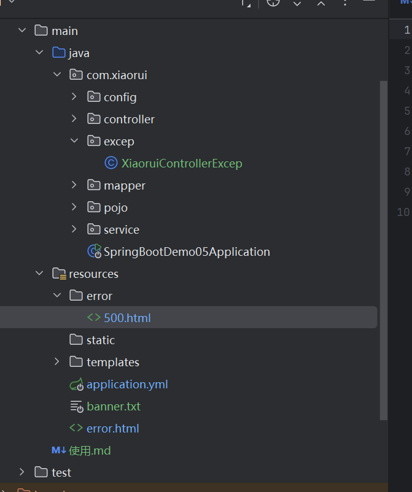
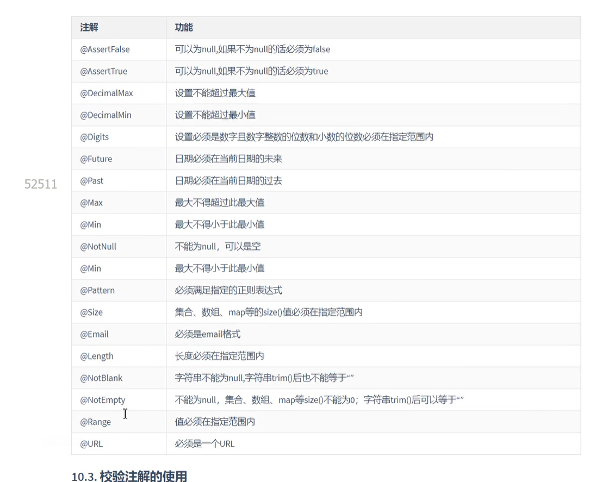

SpringBoot
整合Mybatis

1.pojo创建跟数据库表一样的结构 类名字也要一样
2.在mapper层创建对应表的Mapper （创建的是接口）
    使用@Mapper注解标记为Mapper
    在启动类上方引入Mapper依赖@MapperScan("com.xiaorui.mapper")
    可以在方法上面用语句@Select("select * from xiaorui where id=#{id}")
    也可以使用xml文件进行配置
<?xml version="1.0" encoding="UTF-8" ?>
<!DOCTYPE mapper
        PUBLIC "-//mybatis.org//DTD Mapper 3.0//EN"
        "http://mybatis.org/dtd/mybatis-3-mapper.dtd">
<mapper namespace="com.xiaorui.mapper.UserMapper">
    <select id="selectUser" parameterType="int" resultType="com.xiaorui.pojo.User">
        select * from user where id = #{arg0}
    </select>
    <update id="updateUser" parameterType="User">
        update user set name=#{name} where id=#{id}
    </update>
    <insert id="saveUser" parameterType="User">
        insert user (id,name,age) value (#{id},#{name},#{age})
    </insert>
    <delete id="deleteUser" parameterType="int">
        delete from user where id=#{arg0}
    </delete>
    <select id="selectAllUser">
        select * from user
    </select>
</mapper>
3.在service层创建接口
    写入与mapper层一样的方法，名字可以不一样
    在service层下创建impl
    创建刚刚接口的实现类impl
    实现对应的方法
    加入@Service注解，如果有多个实现类可以@Service("")起名字 或者@Qualifier使用默认
    @Autowired
    private xiaoRuiMapper xiaoRuiMapper;
    自动引入Mapper的依赖、
、   实现service接口的方法
    直接
    @Override
    public xiaorui selectOne(int id) {
        return xiaoRuiMapper.selectOneUser(id);
    }
4.controller层
    创建实现类
    get/查
    post/增
    put/改
    delete/删
    4.1 自动注入service层依赖
    @Autowired
    private XiaoruiService xiaoruiService;
    
    查询消息
    @GetMapping("/user/{id}")
    @ResponseBody
    @Parameter(name="查询 Get",description = "管理层 查询 用户 单条 信息 返回xiaorui对象 查询条件 输入 id")
    public xiaorui selectController(@PathVariable Integer id){
        System.out.println("查询了一条消息");
        return xiaoruiService.selectOne(id);
    }

    更改
    @PutMapping("/user")
    @ResponseBody
    @Operation(summary = "根据用户 xiaorui对象 更改 xiaorui属性")
    @Parameter(name = "更改 PUT",description = "管理层 更改 用户 单条 信息 返回 int 更改条件 输入 xiaorui对象")
    public int updataController(@RequestBody xiaorui xiaorui){
        return xiaoruiService.update(xiaorui);
    }

    增加
    @PostMapping("/user")
    @ResponseBody
    @Operation(summary = "添加一个用户 ")
    @Parameter(name = "添加用户 POST",description = "添加一个用户 选择存入数据库 返回int")
    public int saveController(@RequestBody xiaorui xiaorui){
        return xiaoruiService.save(xiaorui);
    }
    
    删除
    @DeleteMapping("/user/{id}")
    @ResponseBody
    @Operation(summary = "删除一个用户 ")
    @Parameter(name = "删除用户 Delete",description = "删除一个用户 返回一个int 需要在地址栏输入id")
    public int deleteController(@PathVariable Integer id){
        return  xiaoruiService.delete(id);
    }

    查询所有
    controller
    @RequestMapping("/show2")
    public String show2(HttpServletRequest request){
        request.setAttribute("msg3",xiaoruiService.selectAllUserTable());
        return "test01";
    }
    
        mapper
        @Select("select * from xiaorui")
        @Parameter(description = "查询所有，以table形式展示")
        List<xiaorui> selectAllUserTable();

        service
        @RequestMapping("/show2")
        public String show2(HttpServletRequest request){
            request.setAttribute("msg3",xiaoruiService.selectAllUserTable());
            return "test01";
        }

使用了阿里云的Druid
<dependency>
<groupId>com.alibaba</groupId>
<artifactId>druid-spring-boot-starter</artifactId>
<version>1.2.27</version>
//<!--<version>1.2.11</version>-->
</dependency>

spring:
datasource:
type: com.alibaba.druid.pool.DruidDataSource  # 明确指定Druid数据源
driver-class-name: com.mysql.cj.jdbc.Driver
url: jdbc:mysql://117.72.119.212:3306/roottest?characterEncoding=utf8&useSSL=false&serverTimezone=Asia/Shanghai
username: roottest
password: roottest
druid:
# 连接池的配置信息
initial-size: 5  # 初始化连接数大小
max-active: 30  # 最大连接数
min-idle: 5   # 最小连接数

      # 配置获取连接等待超时的时间
      max-wait: 60000  #如果连接都被占用，最大等待时间1min=60000ms
      validation-query: SELECT 1 FROM DUAL  #通过从续表查询来监控是否连接数据库，语句执行能连接，语句不执行没连接
      # 配置一个连接在池中最小空闲的时间，单位是毫秒
      min-evictable-idle-time-millis: 300000
      test-while-idle: true
      # 开启SQL监控、防火墙监控、日志监控
      filters: stat,wall,slf4j
      # 配置DruidStatViewServlet
      stat-view-servlet:
        # 登录名
        login-username: admin
        # 登录密码
        login-password: admin
        url-pattern: /druid/*
        # IP白名单(没有配置或者为空，则允许所有访问)
        allow: 192.167.10.1,127.0.0.1,localhost  # 本机和设置的ip可以访问后台管理界面
        reset-enable: false # 不要重置
        # 启用控制台-后台管理界面，必须启用，否则访问界面会404
        enabled: true

可以选择使用Banner
在resources 创建 banner.txt 在
https://patorjk.com/software/taag/#p=display&f=Graffiti&t=Echo%20Rain 
生成

热部署
<dependency>
<groupId>org.springframework.boot</groupId>
<artifactId>spring-boot-devtools</artifactId>
<scope>runtime</scope>
<optional>true</optional>
</dependency>

devtools:
restart:
enabled: true
additional-paths: src/main/java
exclude: WEB-INF/**

logback日志
application.yml:
logging:
level:
org.example.mapper: trace

Thymelea:
<!DOCTYPE html>
<html lang="en" xmlns:th="http://www.thymeleaf.org">
<head>
    <meta charset="UTF-8">
    <title>Title</title>
</head>
<body>
    <!---->
        <table th:each="user:${msg3}" width="500" border="2">
            <tr>
                <td>用户ID</td>
                <td>用户名</td>
                <td>年龄</td>
                <td>性别</td>
            </tr>
            <tr>
                <td th:text="${user.id}"></td>
                <td th:text="${user.name}"></td>
                <td th:text="${user.age}"></td>
                <td th:text="${user.sex}"></td>
            </tr>
        </table>
</body>
</html>

SpringDoc
在Controller层使用

@Controller
@Tag(name="用户管理控制层 " ,description = "用户控制层")
public class XiaoruiController {
@Autowired
private XiaoruiService xiaoruiService;

    @Operation(summary = "根据用户 id 查询 用户所有信息")
    @GetMapping("/user/{id}")
    @ResponseBody
    @Parameter(name="查询 Get",description = "管理层 查询 用户 单条 信息 返回xiaorui对象 查询条件 输入 id")
    public xiaorui selectController(@PathVariable Integer id){
        System.out.println("查询了一条消息");
        return xiaoruiService.selectOne(id);
    }

    @PutMapping("/user")
    @ResponseBody
    @Operation(summary = "根据用户 xiaorui对象 更改 xiaorui属性")
    @Parameter(name = "更改 PUT",description = "管理层 更改 用户 单条 信息 返回 int 更改条件 输入 xiaorui对象")
    public int updataController(@RequestBody xiaorui xiaorui){
        return xiaoruiService.update(xiaorui);
    }

    @PostMapping("/user")
    @ResponseBody
    @Operation(summary = "添加一个用户 ")
    @Parameter(name = "添加用户 POST",description = "添加一个用户 选择存入数据库 返回int")
    public int saveController(@RequestBody xiaorui xiaorui){
        return xiaoruiService.save(xiaorui);
    }

    @DeleteMapping("/user/{id}")
    @ResponseBody
    @Operation(summary = "删除一个用户 ")
    @Parameter(name = "删除用户 Delete",description = "删除一个用户 返回一个int 需要在地址栏输入id")
    public int deleteController(@PathVariable Integer id){
        return  xiaoruiService.delete(id);
    }

    @GetMapping("/users/All")
    @ResponseBody//http://localhost:8888/users/All?pageNum=2&pageSize=3
    @Operation(summary = "查询所有用户信息")
    @Parameter(name = "查询 Get",description = "查询所有用户信息 不需要传入任何参数！！！！！")
    public PageInfo<xiaorui> selectAll(int pageNum, int pageSize){
        System.out.println("查询数据库的Controller层");
        return xiaoruiService.selectAll(pageNum, pageSize);
    }

    @RequestMapping("/show2")
    public String show2(HttpServletRequest request){
        request.setAttribute("msg3",xiaoruiService.selectAllUserTable());
        return "test01";
    }
}

<dependency>
			<groupId>org.springdoc</groupId>
			<artifactId>springdoc-openapi-starter-webmvc-ui</artifactId>
			<version>2.1.0</version>
</dependency>

Tag
Operation
Parameter

JDBC事务处理：
 防止因为程序异常或错误，导致数据库进行修改或删除添加方法没有执行完全却修改了数据库
@Override
@Transactional(propagation = Propagation.REQUIRED)
public int delete(int id) {
return xiaoRuiMapper.deleteUser(id);
}
加入@Transactional(propagation = Propagation.REQUIRED)即可

异常

可以创建error.html文件 所有异常都会进到这个页面
也可以创建error文件夹 里面放入500.html 404.html等 
出现对应错误即可跳入

也可以进行自定义处理异常
@ControllerAdvice  //这个是让spring知道的当前是异常处理的注解
public class XiaoruiControllerExcep {
@ExceptionHandler(java.lang.ArithmeticException.class)//出现什么问题
public String handleException(){
System.out.println("异常处理逻辑....");
System.out.println("异常处理逻辑....");
System.out.println("异常处理逻辑....");
System.out.println("异常处理逻辑....");
return "myerror";
}
}

数据校验 Validation

<dependency>
			<groupId>org.springframework.boot</groupId>
			<artifactId>spring-boot-starter-validation</artifactId>
</dependency>

